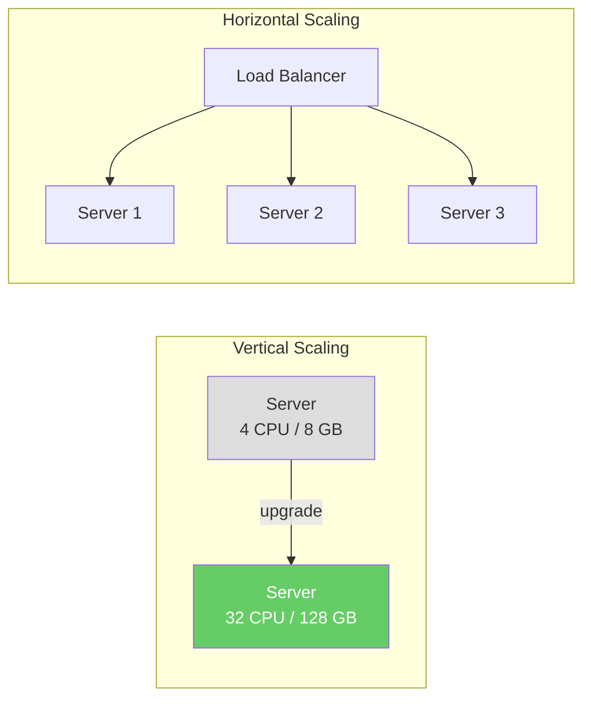
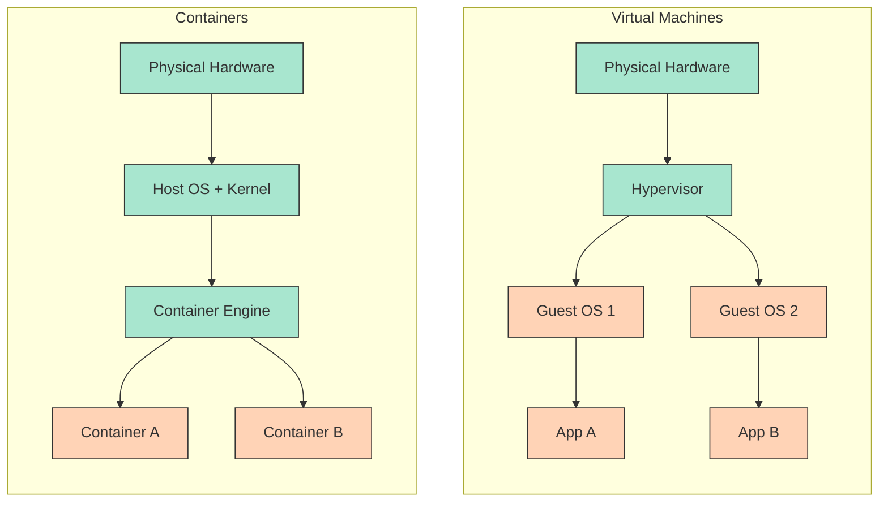
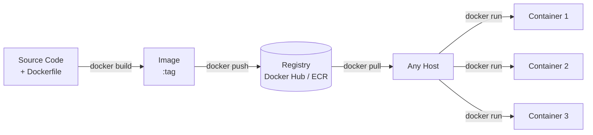

When a server cannot handle growing traffic, two strategies exist:

**Vertical scaling** (scale-up)
: Replace the server with a more powerful one — more CPU, RAM, faster disk. Simple, but bounded: there is a physical limit to how large a single machine can be, and upgrades require downtime.

**Horizontal scaling** (scale-out)
: Add more servers and distribute the load across them. Theoretically unbounded, but introduces a critical problem: **consistency across environments**.

An application that works on a developer's laptop may fail in production because of different OS versions, library versions, or environment variables — the infamous *"it works on my machine"* problem. **Containerisation** solves this by packaging the application together with all its dependencies into a portable, self-contained unit that runs identically everywhere.

---

## Containers vs. Virtual Machines

Both containers and virtual machines (VMs) provide isolation, but at different levels of the stack:

:material-square:{ style="color:#a8e6cf" } Provider / shared layer &nbsp;&nbsp; :material-square:{ style="color:#ffd3b6" } Application layer

| Aspect | Docker Containers | Virtual Machines |
|---|---|---|
| **Isolation** | Process-level — share the host kernel | Full OS isolation — each VM has its own kernel |
| **Resource overhead** | Lightweight — no duplicate OS per container | Higher — each VM carries a complete OS |
| **Startup time** | Seconds | Minutes (full OS boot) |
| **Portability** | High — image bundles app and all dependencies | Lower — OS-specific configuration |
| **Security boundary** | Weaker (shared kernel) | Stronger (separate kernel) |
| **Typical use** | Microservices, CI/CD, horizontal scaling | Different guest OS, strong isolation requirements |

The key insight: containers share the host kernel, so they start in seconds and consume far less memory. VMs carry their own kernel — giving stronger isolation at the cost of higher overhead.

---

## The container lifecycle

A **Dockerfile** describes how to build the image. An **image** is the immutable artifact — it gets versioned, stored in a registry, and pulled onto any machine. A **container** is a running instance of an image — isolated, ephemeral, and disposable.

---

## Topics covered

-   :fontawesome-brands-docker:{ .lg .middle } **Docker**

    ---

    Core concepts of Docker: images, containers, the Docker Engine, Dockerfiles (including multi-stage builds), essential commands, networking, and volumes.

    [:octicons-arrow-right-24: Docker](docker/index.md)

-   :material-file-code:{ .lg .middle } **Docker Compose**

    ---

    Declarative multi-container orchestration with `compose.yaml`. Covers service definitions, networking, volumes, environment variables, health checks, and dependency ordering.

    [:octicons-arrow-right-24: Docker Compose](compose/index.md)

---

## Containerisation in the cloud

Cloud providers offer managed container services that add automatic scheduling, scaling, load balancing, and deep integration with other cloud services on top of the container model:

| Service | Provider | Model |
|---|---|---|
| **ECS / Fargate** | AWS | Managed containers — no cluster to operate |
| **EKS** | AWS | Managed Kubernetes |
| **Cloud Run** | Google | Serverless containers — scales to zero |
| **GKE** | Google | Managed Kubernetes |
| **AKS** | Azure | Managed Kubernetes |

=== ":fontawesome-brands-google: Google"

    :fontawesome-brands-youtube:{ .youtube } [Inside a Google data center](https://youtu.be/XZmGGAbHqa0){:target='_blank'}

    [{ width=100% }](https://youtu.be/XZmGGAbHqa0){:target='_blank'}

=== ":fontawesome-brands-aws: AWS"

    :fontawesome-brands-youtube:{ .youtube } [Inside Amazon's Massive Data Center](https://youtu.be/q6WlzHLxNKI){:target='_blank'}

    [{ width=100% }](https://youtu.be/q6WlzHLxNKI){:target='_blank'}

=== ":simple-tesla: Tesla"

    :fontawesome-brands-youtube:{ .youtube } [Inside Elon Musk's Colossus Supercomputer!](https://youtu.be/Tw696JVSxJQ){:target='_blank'}

    [{ width=100% }](https://youtu.be/Tw696JVSxJQ){:target='_blank'}

---

[^1]: [Docker Documentation](https://docs.docker.com/){:target="_blank"}
[^2]: [Docker vs. Virtual Machines: Differences You Should Know](https://cloudacademy.com/blog/docker-vs-virtual-machines-differences-you-should-know/){:target="_blank"}
[^3]: BURNS, B. et al. *Kubernetes: Up and Running*, 3rd ed. O'Reilly, 2022.
