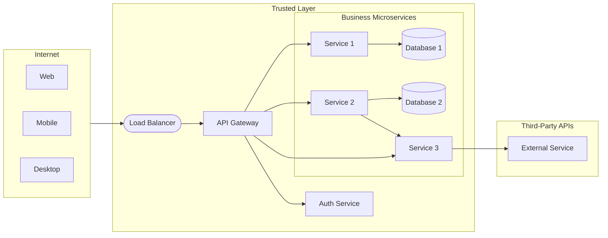

A production microservices system is more than a collection of independent services. It requires a set of **infrastructure components** that handle cross-cutting concerns — routing, security, discovery, configuration, and observability — so that individual services can stay focused on their business domain.

---

## Components

<figure markdown>
  {target="_blank"}
  <figcaption><i>Source: <a href="https://bytebytego.com/guides/what-does-a-typical-microservice-architecture-look-like/" target="_blank">System Design 101 — Microservice Architecture</a></i></figcaption>
</figure>

### Load Balancer

Distributes incoming traffic across multiple instances of a service. Prevents any single instance from becoming a bottleneck and routes traffic away from unhealthy instances.

- **Layer 4 (TCP):** Fast, routes by IP/port — used for raw throughput.
- **Layer 7 (HTTP):** Routes by URL path, headers, or cookies — enables content-based routing and canary deployments.

### CDN (Content Delivery Network)

A geographically distributed network of caches that serves static assets (images, JS, CSS) from the location nearest to the user. Reduces latency for clients worldwide and offloads traffic from origin servers.

### API Gateway

The **single entry point** for all external clients. The gateway is responsible for:

| Concern | How |
|---|---|
| **Routing** | `/orders/**` → Order Service, `/products/**` → Product Service |
| **Authentication** | Validates JWT tokens before forwarding requests |
| **Rate limiting** | Protects services from traffic spikes or abusive clients |
| **Request/response transformation** | Adds headers, aggregates multiple service calls |
| **SSL termination** | Handles HTTPS; services communicate in plain HTTP inside the trusted network |

The gateway is the boundary between the public internet and the trusted internal network.

### Identity Provider

Manages user authentication and authorisation using standard protocols:

- **OAuth 2.0** — delegation framework: a user grants a client access to their resources without sharing their password.
- **OpenID Connect (OIDC)** — identity layer on top of OAuth 2.0: provides a JWT identity token (`id_token`) in addition to the access token.
- **JWT (JSON Web Token)** — a signed, self-contained token that encodes claims (user ID, roles, expiry). Services validate the signature without calling the identity provider on every request.

### Service Discovery & Registry

In a dynamic environment where service instances scale up/down and IP addresses change, services cannot hard-code endpoints. A **service registry** (Consul, Eureka, Kubernetes DNS) stores the current locations of all service instances. Services register on startup and deregister on shutdown.

- **Client-side discovery:** the caller queries the registry and load-balances itself.
- **Server-side discovery:** the load balancer or gateway queries the registry on behalf of the caller.

### Configuration Service

Centralises configuration for all services (Spring Cloud Config, AWS Parameter Store, Vault). Changes can be pushed to running services without redeployment. Secrets (credentials, API keys) are stored encrypted and injected at runtime.

---

## Our architecture

The diagram below shows the reference architecture used in this course:

Key design decisions in this architecture:

- **All external traffic enters through the gateway.** Internal services are not reachable from the internet.
- **Auth is a separate service.** The gateway delegates token validation to the Auth Service; individual business microservices trust the claims in the forwarded JWT.
- **Each service has its own database.** No shared schema. Services communicate through APIs, not through shared tables.
- **Services can call each other.** Service 2 calls Service 3 for a sub-operation. In synchronous flows, this is fine; for reliability at scale, consider event-driven patterns.

---

## Best practices

<figure markdown>
  { width="100%" }
  <figcaption><i>Source: <a href="https://bytebytego.com/guides/9-best-practices-for-developing-microservices/" target="_blank">System Design 101 — Microservice Best Practices</a></i></figcaption>
</figure>

| Practice | Why it matters |
|---|---|
| **Design for failure** | Any downstream call can fail. Use timeouts, retries with backoff, and circuit breakers. |
| **Automate everything** | Manual deployments at scale are error-prone. CI/CD pipelines, IaC, and container orchestration are prerequisites. |
| **Own your data** | A service that shares its database with another service cannot evolve independently. |
| **Async where possible** | Synchronous chains amplify latency and couple availability. Events decouple producers from consumers. |
| **Observe everything** | Distributed traces, structured logs, and metrics are the only way to understand failures across service boundaries. |
| **Version your APIs** | Services are deployed independently; breaking API changes must be versioned to avoid forcing coordinated deployments. |

---

[^1]: XU, A. [System Design 101](https://github.com/ByteByteGoHq/system-design-101){target="_blank"}
[^2]: NEWMAN, S. *Building Microservices*. O'Reilly, 2021.
