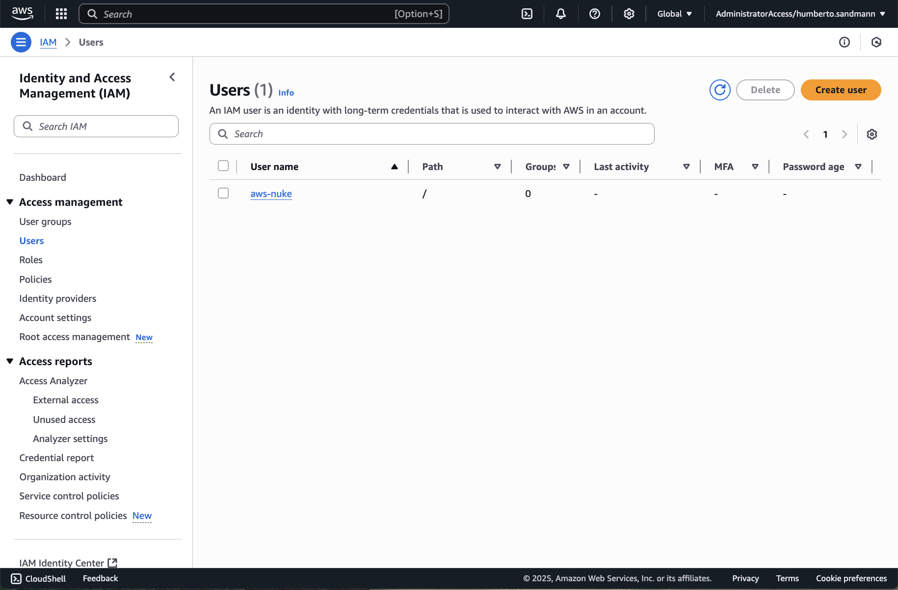
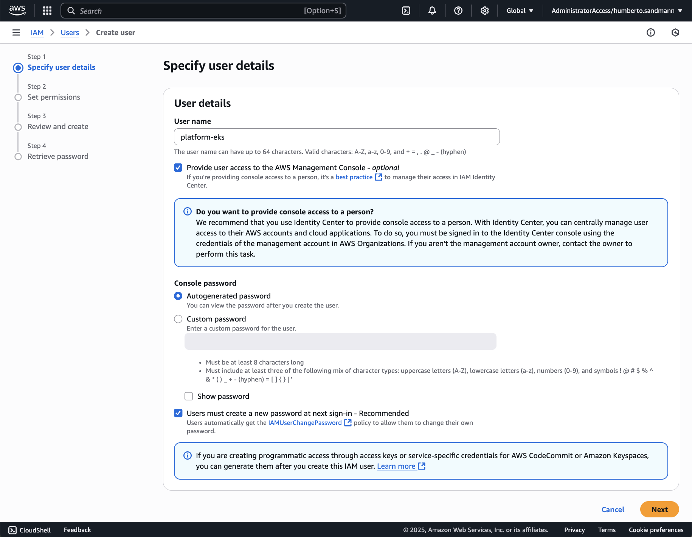
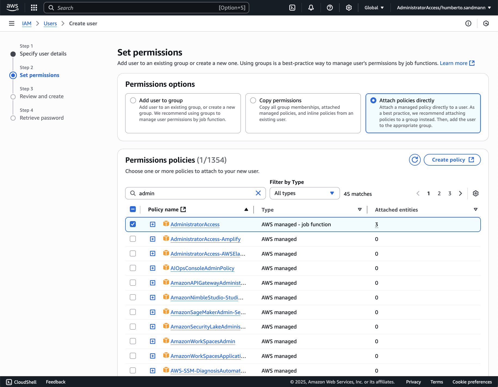
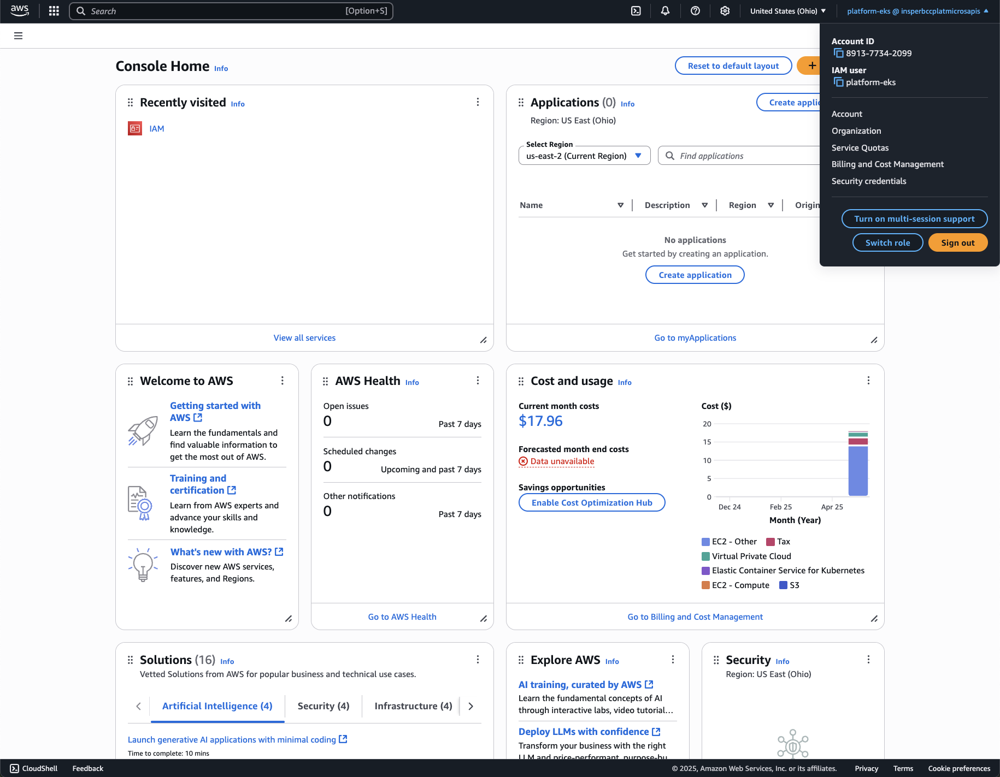
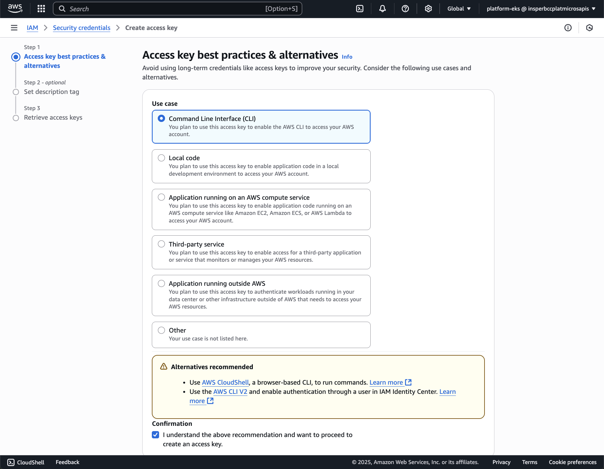
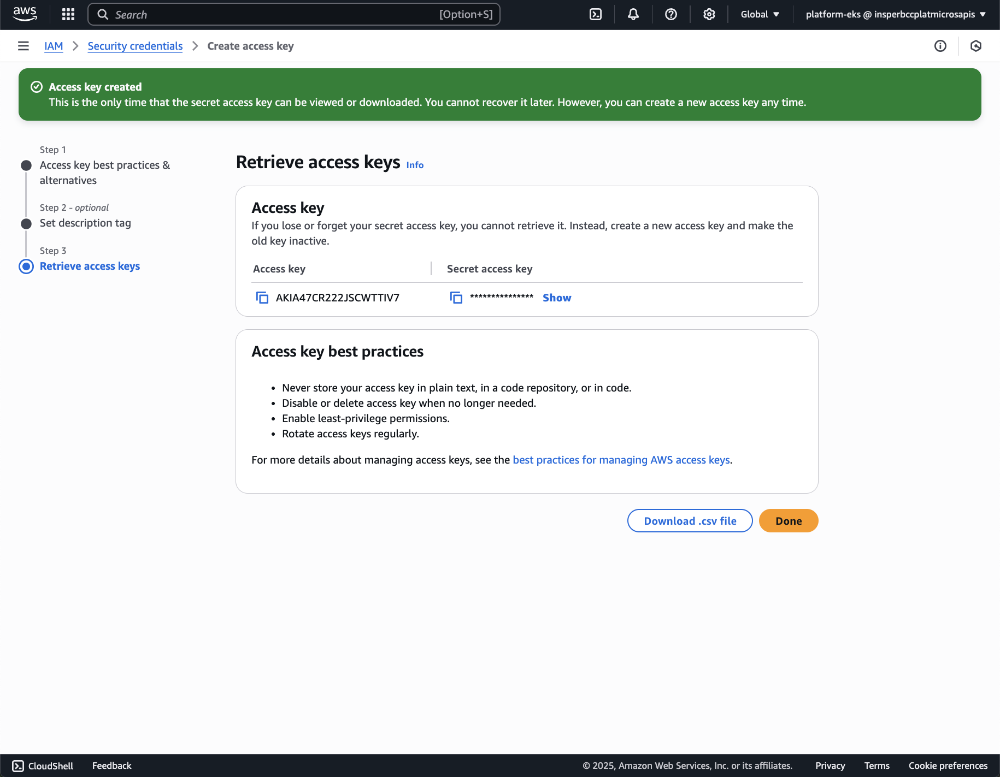

## Configuração do AWS

A AWS é uma plataforma de computação em nuvem que oferece uma ampla gama de serviços, incluindo computação, armazenamento, banco de dados, análise, rede, mobilidade, ferramentas de desenvolvedor, gerenciamento e segurança. Para configurar a AWS, você precisará criar uma conta e configurar os serviços necessários para o seu projeto.

!!! tip "Roadmap"

    **This roudmap is not complete and may not cover all the steps you need to take to configure your AWS environment. It is a good start to help you understand the steps you need to take to configure your AWS environment. You can find more information about each step in the AWS documentation.**

    Create an AWS account and configure the AWS CLI. You can use the AWS CLI to manage your AWS services from the command line.
    
    === "1. Create User"

        { width=100% }
        { width=100% }
        { width=100% }

    === "2. Loggin at AWS Dashboard"

        Loggin at the AWS Dashboard with the created user.

    === "3. Create Access Key"

        { width=100% }
        { width=100% }
        { width=100% }

    === "4. Configure AWS CLI"

        [AWS CLI](https://docs.aws.amazon.com/cli/latest/userguide/getting-started-install.html){target="_blank"}
