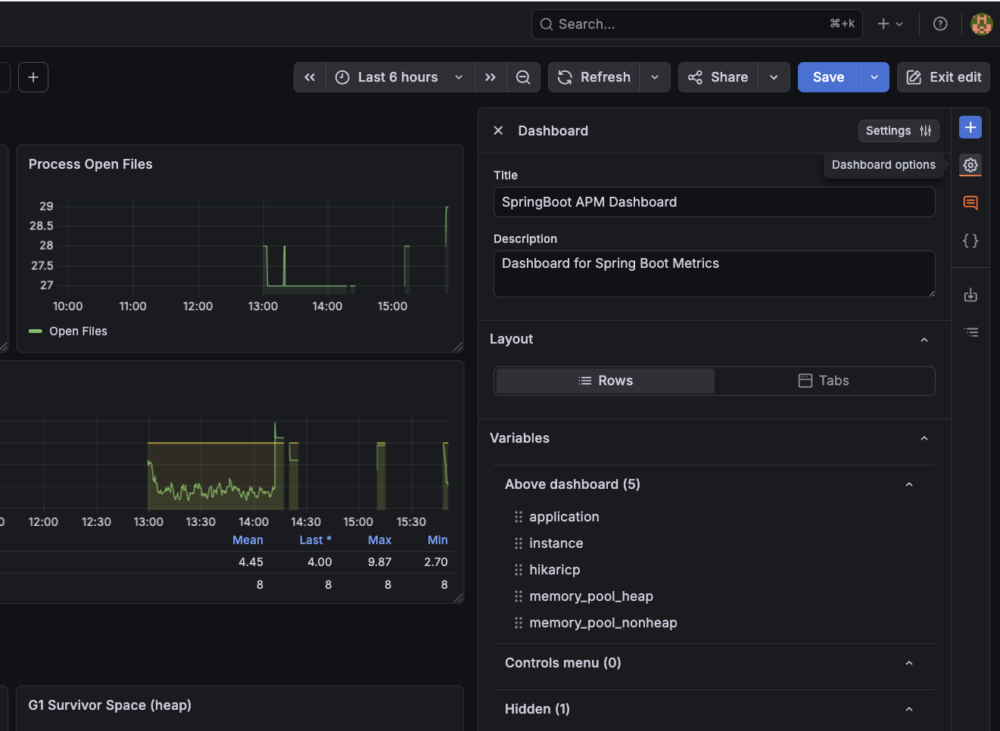
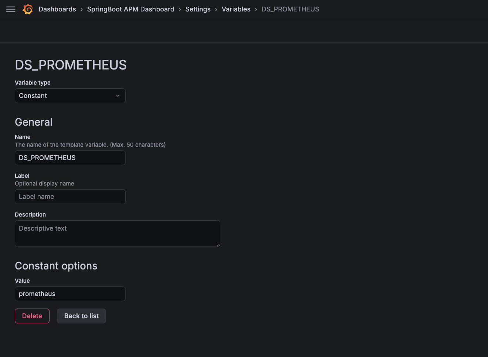

[Grafana](https://grafana.com){target="_blank"} connects to Prometheus as a datasource and provides rich, interactive dashboards for visualizing the collected metrics.

Create the datasource provisioning file at `setup/grafana/provisioning/datasources/datasources.yml`:

``` { .yaml .copy .select linenums="1" title="datasources.yml" }
apiVersion: 1
datasources:
  - name: Prometheus
    type: prometheus
    uid: prometheus
    access: proxy
    url: http://prometheus:9090
    isDefault: true
```

Grafana loads this file automatically on startup, connecting it to the Prometheus instance on the internal Docker network — no manual UI configuration needed.

Once the stack is running, open Grafana in the browser:

[http://localhost:3000/](http://localhost:3000/){target="_blank" .md-button}

Login with the default credentials:

| Field    | Value   |
|----------|---------|
| Username | `admin` |
| Password | `admin` |

!!! tip "Dashboard Marketplace"

    Grafana provides a large library of pre-built dashboards for common stacks. For Spring Boot and Micrometer metrics, a solid starting point is the **JVM (Micrometer)** dashboard (ID `4701`) or the **SpringBoot APM Dashboard** (ID `12900`).

    To import it: go to **Dashboards → Import**, enter ID `4701` or `12900`, and select the Prometheus datasource.

    Browse the full library at [grafana.com/grafana/dashboards](https://grafana.com/grafana/dashboards/){target="_blank"}.

    For these dashboards to work correctly, ensure you select the Prometheus datasource that was provisioned for the `DS_PROMETHEUS` variable. To set this variable, go to **Dashboard -> Edit -> Dashboard Options**:

    

    Click on **Settings** and go to **Variables** Tab. Create a new constant variable named `DS_PROMETHEUS`, set its type to `Constant`, and its value to `prometheus` (the name defined uid in `datasources.yml`):

    

    Save the dashboard and you should see all metrics start populating immediately. Explore the various panels to monitor request rates, JVM memory usage, response latencies, and error rates across the entire platform in real time.
