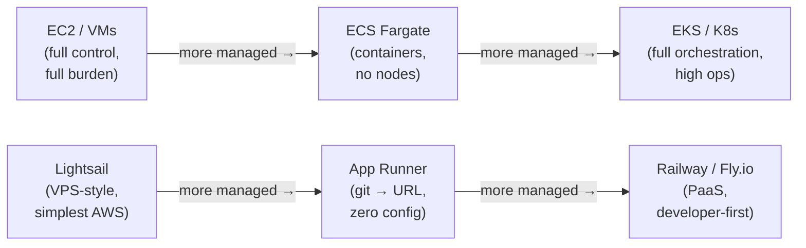
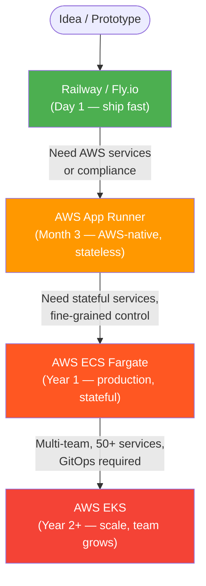

# Cloud Deployment Roadmap

Kubernetes is not the right answer for every team. It solves real problems at scale — but it introduces significant operational complexity and cost that can sink a small team or startup before they ship their first feature. This class maps the deployment landscape and provides a decision framework: given your team size, service count, and operational maturity, what is the right infrastructure choice *right now*, and how do you grow into the next tier?

---

## 1. The Spectrum of Managed Infrastructure

Cloud providers have progressively abstracted away infrastructure concerns. The tradeoff is always the same: less control, less operational burden.



!!! info "Two paths, not one axis"
    There is no single spectrum here. ECS is not "more managed" than App Runner — they target different use cases. The diagram shows two paths: the **AWS-native path** (VM → ECS → EKS) and the **developer-experience path** (Lightsail → App Runner → PaaS). Your team's context determines which path is relevant.

| Platform | What it hides | What you manage | Best for | Est. monthly cost (3 services) |
|---|---|---|---|---|
| **AWS Lightsail** | Hardware, networking | OS, runtime, scaling | First cloud deployment, student projects | $15–50 |
| **Railway / Render** | Everything except code | Env vars, domains | Startups, prototypes, side projects | $5–30 |
| **Fly.io** | Infrastructure | Dockerfile, regions | Global low-latency apps, edge deployments | $5–50 |
| **AWS App Runner** | Containers, scaling | Container image, env vars | Stateless microservices on AWS | $25–80 |
| **AWS ECS Fargate** | EC2 nodes | Task definitions, service scaling, ALB | Medium-scale, AWS-native, production | $60–200 |
| **AWS EKS** | Control plane | Node groups, networking, add-ons | Large teams, complex workloads, multi-tenant | $150–500+ |
| **Self-hosted K3s** | Cloud provider | All K8s operations | On-prem, homelab, cost-sensitive | Hardware only |

---

## 2. Decision Roadmap by Team Size

=== "Small (1–5 devs)"

    **Fewer than 10 services? Start here.**

    ```mermaid
    flowchart TD
        A["Need custom domains + HTTPS?"]
        B["Railway / Render\n(free tier)"]
        C["Need a managed database?"]
        D["Fly.io"]
        E["AWS Lightsail Containers\nor AWS App Runner"]

        A -->|No| B
        A -->|Yes| C
        C -->|No| D
        C -->|Yes| E
    ```

    **Key recommendation:** Railway for the fastest time-to-live — connect a GitHub repo and you have a live URL in minutes. AWS App Runner when you are already in the AWS ecosystem and want a managed container platform without ECS complexity.

    !!! danger "EKS at this scale"
        The EKS control plane alone costs **$72/month**. Add a minimum node group ($50–100/month) and you are already spending more than your entire infrastructure should cost for a small team. Kubernetes is not an option here — it is a liability.

=== "Medium (5–20 devs)"

    **10–50 services. You need production-grade infrastructure but probably not a full platform engineering team.**

    ```mermaid
    flowchart TD
        A["Dedicated ops / platform engineer?"]
        B["ECS Fargate + ALB + RDS\n(serverless containers, no nodes)"]
        C["EKS (managed node groups)\nor ECS with more control"]

        A -->|No| B
        A -->|Yes| C
    ```

    **Why ECS Fargate for medium teams:** no EC2 nodes to patch, scales to zero, integrates natively with AWS IAM, Secrets Manager, and ECR. You lose the Kubernetes ecosystem but gain roughly 40% cost reduction and dramatically simpler day-to-day operations.

    | | ECS Fargate | EKS |
    |---|---|---|
    | Node management | None (serverless) | You manage node groups |
    | Learning curve | Low (task definitions) | High (full K8s API) |
    | Ecosystem (Helm, CRDs) | Limited | Full |
    | Cost at 10 services | ~$120/month | ~$300/month |
    | Multi-cloud portability | AWS-only | Portable |
    | GitOps (ArgoCD, Flux) | Limited | First-class |

=== "Large (20+ devs)"

    **50+ services. EKS is the right answer — now the operational cost is justified.**

    At this scale, you need:

    - **Managed node groups** (or Karpenter for bin-packing autoscaling)
    - **ArgoCD** for GitOps — declarative cluster state from Git
    - **AWS Load Balancer Controller** — provision ALB/NLB from Kubernetes Ingress resources
    - **external-secrets-operator** — sync Vault or AWS Secrets Manager secrets into Kubernetes Secrets
    - **Separate clusters per environment** — dev, staging, prod each get their own EKS cluster

    | Add-on | Purpose |
    |---|---|
    | **Karpenter** | Node autoscaling — provision exactly the right instance types for pending pods |
    | **ArgoCD** | GitOps — declarative cluster state reconciled from Git |
    | **AWS Load Balancer Controller** | Provision ALB/NLB from Kubernetes Ingress resources |
    | **External Secrets Operator** | Sync Vault/Secrets Manager secrets into Kubernetes Secrets |
    | **Metrics Server** | Enables HPA (Horizontal Pod Autoscaler) |
    | **Cluster Autoscaler** | Alternative to Karpenter for node scaling |

---

## 3. Platform Deep-Dives

### AWS Lightsail Containers

Lightsail wraps containers in an abstraction that feels like Heroku: push an image, set environment variables, choose an instance size, get a public HTTPS endpoint. No VPCs, security groups, or IAM policies to configure.

```termynal
$ aws lightsail create-container-service --service-name my-api \
    --power small --scale 1
$ aws lightsail create-container-service-deployment \
    --service-name my-api \
    --containers '{"my-api":{"image":"my-registry/my-api:latest","ports":{"8080":"HTTP"}}}' \
    --public-endpoint '{"containerName":"my-api","containerPort":8080}'
```

!!! warning "Lightsail networking limitations"
    Lightsail does not use standard AWS VPC networking. Services deployed on Lightsail cannot talk to RDS instances in a normal VPC without Lightsail VPC peering — an extra configuration step many tutorials skip. There is also no service-to-service discovery: each service gets its own public URL.

---

### AWS App Runner

App Runner takes a container image (or a Git repository with a Dockerfile) and provisions a fully managed HTTPS endpoint that auto-scales from 0 to N instances with no server management.

```yaml
version: 1.0
runtime: corretto17
build:
  commands:
    build:
      - mvn clean package -DskipTests
run:
  command: java -jar target/app.jar
  network:
    port: 8080
  env:
    - name: SPRING_PROFILES_ACTIVE
      value: prod
```

!!! warning "VPC Connector required for RDS"
    App Runner runs in an AWS-managed VPC by default — it has no network path to resources in your own VPC. Connecting to an RDS instance requires configuring an **App Runner VPC Connector**, which attaches your App Runner service to a subnet in your VPC. This is straightforward but not automatic.

---

### Railway

Railway provides the simplest developer experience in the ecosystem: connect a GitHub repo, Railway detects the language and framework, builds and deploys automatically.

What Railway provides out of the box:

- Automatic HTTPS with custom domains
- Built-in Postgres, Redis, and MongoDB as add-on services
- Deploy on push — no CI/CD pipeline needed initially
- Dashboard with logs, metrics, and environment variable management

!!! warning "Railway trade-offs at scale"
    Railway gives you very little control over networking — there is no VPC, no private subnets, no security group equivalent. There is also no Kubernetes ecosystem (no Helm, no CRDs, no GitOps tooling). Vendor lock-in becomes a real risk once you have more than 10–15 services and complex inter-service networking requirements.

---

### Fly.io

Fly.io runs containers on edge nodes distributed worldwide, close to your users. A `fly.toml` config file defines the application; `flyctl deploy` handles building and deploying globally.

```toml
app = "my-order-service"
primary_region = "gru"  # São Paulo

[build]
  dockerfile = "Dockerfile"

[http_service]
  internal_port = 8080
  force_https = true

[env]
  SPRING_PROFILES_ACTIVE = "prod"
```

**Strong suit:** Fly.io places your containers in regions close to your users — deploying to `gru` (São Paulo) means ~15ms latency for most Brazilian users, and you can add `iad` (Virginia) or `lhr` (London) with a single flag to serve global traffic.

**Weak suit:** Stateful services are more complex than on AWS. Fly has Postgres support but it behaves differently from RDS — backup management, replication, and failover require more manual attention.

---

## 4. Kubernetes Alternatives for Orchestration

If you want Kubernetes features but not EKS cost or complexity, these distributions are worth knowing:

**K3s** — Lightweight Kubernetes (< 100 MB binary) by Rancher. Implements the same API as upstream Kubernetes. Ideal for on-premises deployments, edge devices, and development clusters. The Minikube environment used in this course is effectively a single-node K3s equivalent.

**K0s** — Zero-friction Kubernetes. A single binary with no external dependencies (no external etcd, no separate control plane binary). Common choice for CI/CD environments and on-premises production where K3s's Rancher tooling is unwanted.

**Kind (Kubernetes in Docker)** — Runs a full Kubernetes cluster inside Docker containers. The standard choice for local integration testing and validating Kubernetes manifests before pushing to a real cluster.

| | Minikube | K3s | K0s | Kind |
|---|---|---|---|---|
| Use case | Local dev | On-prem / edge prod | On-prem prod | CI/CD testing |
| Full K8s API | ✓ | ✓ | ✓ | ✓ |
| Production-grade | ✗ | ✓ | ✓ | ✗ |
| Resource requirements | Medium | Very low | Very low | Low |

---

## 5. Cost Comparison

Monthly cost estimates for running three microservices (account, order, gateway) across deployment platforms. Costs vary significantly with traffic and instance size — these are representative baselines for moderate traffic.

```python exec="1" html="1"
import matplotlib.pyplot as plt
import numpy as np

platforms = ["Railway\n(Starter)", "Fly.io", "AWS\nLightsail", "AWS\nApp Runner", "AWS ECS\nFargate", "AWS EKS"]
costs_low = [5, 8, 18, 28, 65, 160]
costs_high = [25, 45, 55, 90, 180, 420]

x = np.arange(len(platforms))
width = 0.35

colors_low = ["#4CAF50", "#4CAF50", "#4CAF50", "#FF9800", "#FF9800", "#F44336"]
colors_high = ["#81C784", "#81C784", "#81C784", "#FFB74D", "#FFB74D", "#EF9A9A"]

fig, ax = plt.subplots(figsize=(11, 5))
bars1 = ax.bar(x - width/2, costs_low, width, label="Low estimate", color=colors_low, alpha=0.9)
bars2 = ax.bar(x + width/2, costs_high, width, label="High estimate", color=colors_high, alpha=0.9)

ax.set_ylabel("Monthly cost (USD)")
ax.set_title("Estimated cost for 3 microservices by deployment platform", fontweight="bold")
ax.set_xticks(x)
ax.set_xticklabels(platforms, fontsize=9)
ax.legend()
ax.axhline(y=72, color="gray", linestyle="--", linewidth=0.8, label="EKS control plane alone ($72)")
ax.text(len(platforms) - 0.5, 74, "EKS control plane ($72)", ha="right", fontsize=8, color="gray")

for bar in bars1:
    ax.text(bar.get_x() + bar.get_width() / 2., bar.get_height() + 2,
            f'${bar.get_height()}', ha='center', va='bottom', fontsize=7.5)
for bar in bars2:
    ax.text(bar.get_x() + bar.get_width() / 2., bar.get_height() + 2,
            f'${bar.get_height()}', ha='center', va='bottom', fontsize=7.5)

plt.tight_layout()
from io import StringIO
buf = StringIO()
plt.savefig(buf, format="svg", transparent=True)
print(buf.getvalue())
plt.close()
```

---

## 6. Migration Path

!!! tip "The right answer changes as you grow"
    Start simple and migrate deliberately. Each migration should be driven by a **concrete pain point**, not speculation about future scale. A working app on Railway is worth more than a perfectly architected EKS cluster with no users.



!!! warning "Avoid premature optimization"
    The cost of migrating from Railway to ECS at 20 services is a few weeks of focused engineering work. The cost of operating EKS for a 3-person startup for a year is 40+ hours of platform ops work that produces no user-facing features. Start simple. Migrate when the pain is real, measurable, and no cheaper fix exists.
