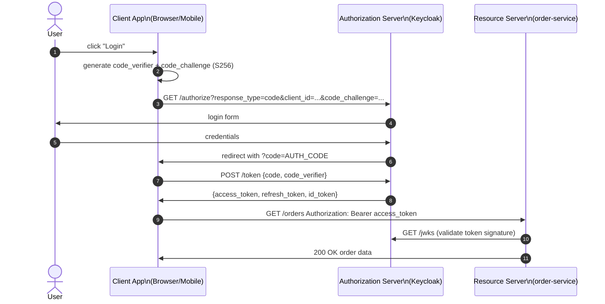
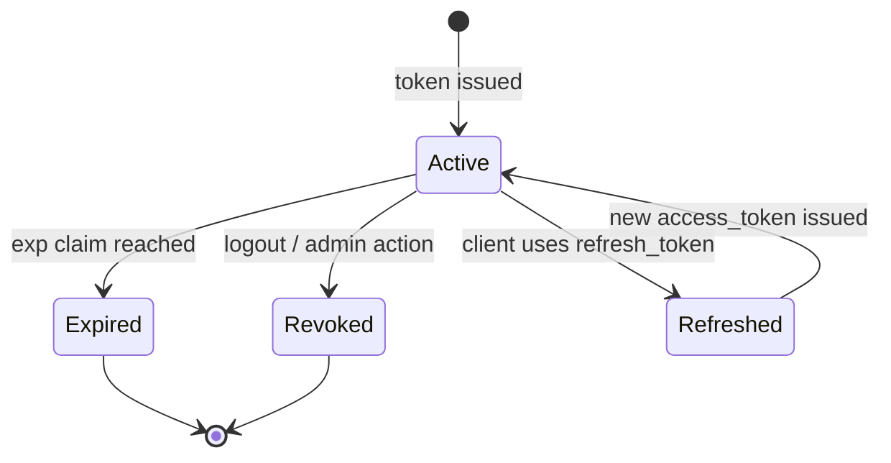
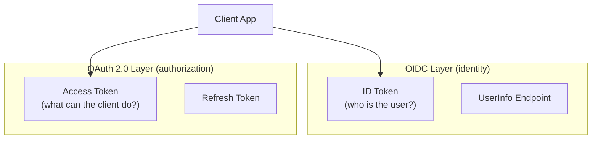
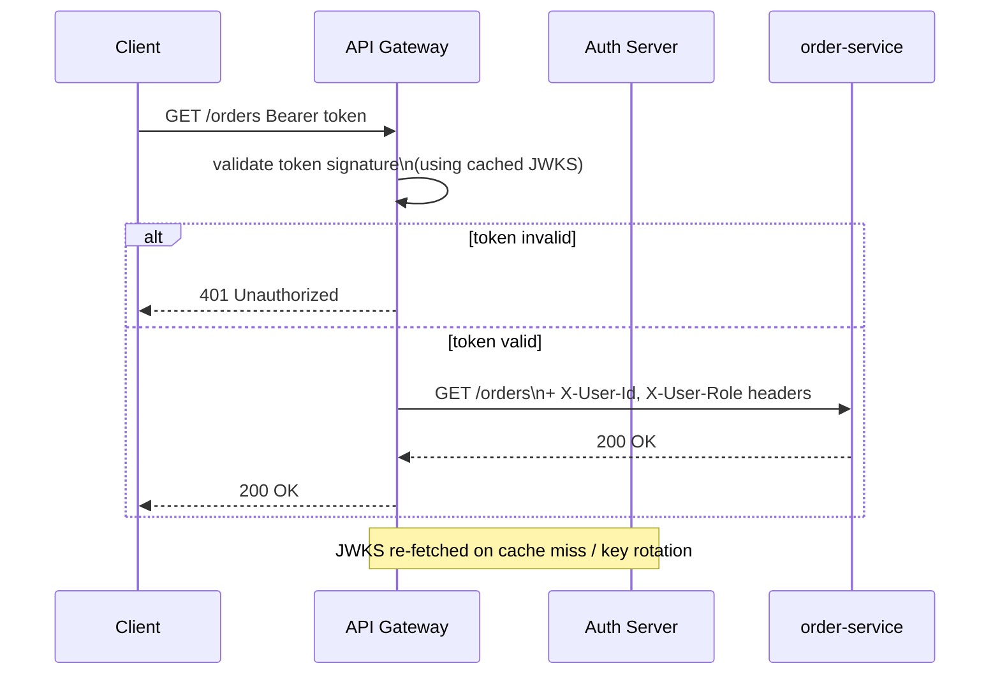
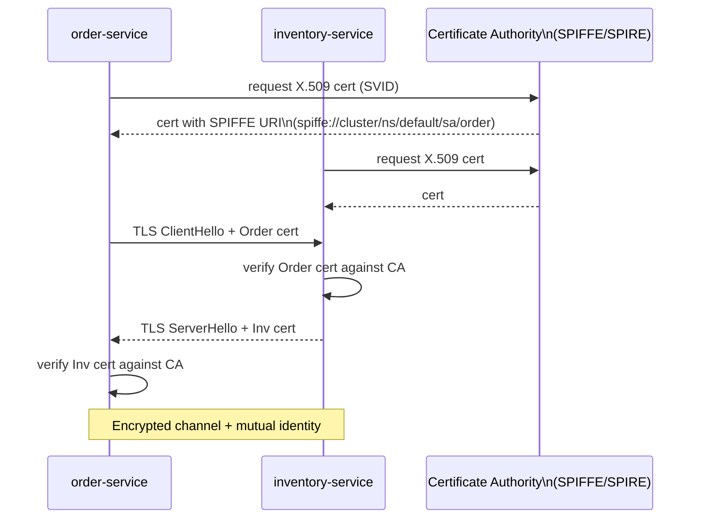
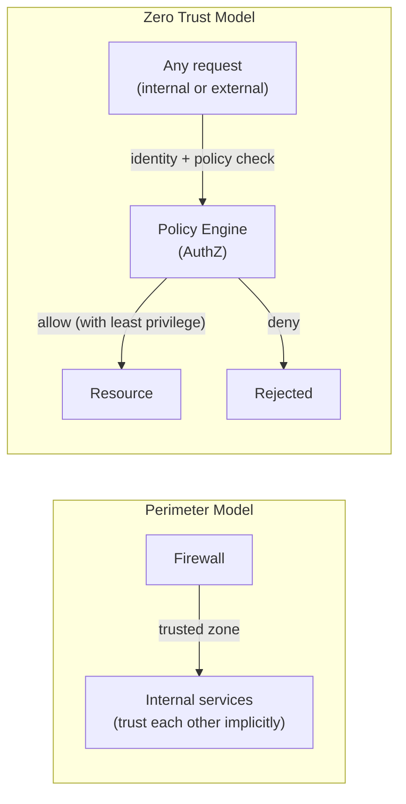

# Security: OAuth 2.0, OIDC & Zero Trust

The previous security hands-on introduced JSON Web Tokens as the mechanism for carrying identity across services. JWT is a transport format — it answers "who is this user?" But it says nothing about how that user proved their identity, who issued the token, or whether it should be trusted by a third-party service. OAuth 2.0 and OpenID Connect fill these gaps, and Zero Trust architecture takes the next step: distrust everything, verify always.

!!! warning "Prerequisite"
    This class builds on the JWT concepts from Hands-on 3. Make sure you are comfortable with JWT structure (header.payload.signature), the `sub`, `exp`, and `iss` claims, and how the Gateway validates tokens before reading this.

---

## What JWT Alone Cannot Do

| Problem | JWT alone | OAuth 2.0 + OIDC |
|---|---|---|
| Third-party login (Google, GitHub) | ✗ Cannot delegate | ✓ Authorization Code flow |
| Token revocation before expiry | ✗ Self-contained, cannot be revoked | ✓ Token introspection endpoint |
| Key rotation without redeployment | ✗ Secret hardcoded in services | ✓ JWKS endpoint — keys fetched dynamically |
| Service-to-service auth | ✗ Usually shares user JWT (wrong) | ✓ Client Credentials grant |
| User identity (not just auth) | ✗ JWT only proves auth | ✓ OIDC ID Token + UserInfo endpoint |

---

## OAuth 2.0

### Roles

| Role | Description | Example |
|---|---|---|
| **Resource Owner** | The user who owns the data | End user of the app |
| **Client** | The application requesting access | Your frontend / mobile app |
| **Authorization Server** | Issues tokens after authenticating the user | Keycloak, Auth0, AWS Cognito |
| **Resource Server** | API that holds the protected resource | order-service, account-service |

### Grant Types

| Grant Type | Use Case | Security Level |
|---|---|---|
| **Authorization Code + PKCE** | Web/mobile apps where a user logs in | Highest — recommended default |
| **Client Credentials** | Service-to-service (no user involved) | High (machine-to-machine) |
| **Device Code** | Devices without a browser (smart TV, CLI) | Medium |
| **Resource Owner Password (ROPC)** | Legacy — avoid completely | Low — exposes credentials to client |

!!! danger "Never use ROPC"
    Resource Owner Password Credentials grant requires the client to collect the user's username and password directly. This defeats the entire purpose of OAuth 2.0 (delegated authorization without sharing credentials). It is deprecated in OAuth 2.1 and should never appear in new code.

### Authorization Code + PKCE Flow



### Access Token Lifecycle



The **access token** is short-lived (typically 5–60 minutes) and sent with every API request. The **refresh token** is long-lived (days to weeks), stored securely by the client, and used only to obtain new access tokens without prompting the user to log in again.

---

## OpenID Connect (OIDC)

OAuth 2.0 handles authorization ("can this client access this resource?"). OpenID Connect adds authentication ("who is this user?") by defining an ID Token — a JWT with standardised user claims.

OIDC extends OAuth 2.0 with three additions:

- The `openid` scope in the authorization request
- **ID Token** — a JWT containing user identity claims (`sub`, `name`, `email`, `iss`, `aud`)
- **UserInfo endpoint** — `GET /userinfo` returns additional profile claims on demand

### ID Token Claims

| Claim | Meaning |
|---|---|
| `sub` | Subject — unique user identifier at this provider |
| `iss` | Issuer — URL of the authorization server |
| `aud` | Audience — must match the client_id |
| `exp` / `iat` | Expiry / issued-at timestamps |
| `name`, `email` | Standard user profile claims |
| `nonce` | Replay attack prevention |

### OAuth 2.0 and OIDC Layers



The Authorization Server exposes a discovery document at `GET /.well-known/openid-configuration` which returns all endpoint URLs, supported scopes, and the JWKS URI. Clients can bootstrap automatically without hardcoded configuration.

### Common OIDC Providers

| Provider | Use case |
|---|---|
| **Keycloak** | Self-hosted, full-featured, ideal for internal services |
| **Auth0** | Managed cloud, fast integration |
| **AWS Cognito** | Native AWS integration |
| **Google / GitHub** | Social login for public-facing apps |

---

## Token Validation at the Gateway

Rather than every microservice validating tokens independently, the Gateway is the single validation point. This keeps auth logic in one place and lets downstream services remain simple.

JWKS-based validation flow:

1. The Auth Server publishes public keys at `/jwks.json`
2. The Gateway fetches and caches JWKS on startup
3. Each incoming request carries `Authorization: Bearer <token>`
4. The Gateway verifies the token signature using the cached JWKS
5. On a `kid` miss (key rotation): re-fetch JWKS once, then retry validation



=== "application.yml"
    ```yaml
    spring:
      security:
        oauth2:
          resourceserver:
            jwt:
              jwk-set-uri: http://keycloak:8080/realms/store/protocol/openid-connect/certs
    ```

!!! tip "Forward user context downstream"
    After validation, the Gateway should forward user identity as trusted headers (e.g., `X-User-Id: <sub>`, `X-User-Role: <role>`) so downstream services do not need to parse tokens. Downstream services must only accept these headers from the Gateway — never from external clients.

---

## Service-to-Service Security (mTLS)

When two services call each other directly (not via the Gateway), how do they trust each other? mTLS (mutual TLS) requires both sides to present a certificate.

- **Standard TLS**: server presents a certificate → client verifies it
- **mTLS**: server AND client both present certificates → both verify the other



Service meshes (Istio, Linkerd) inject sidecar proxies that handle mTLS transparently — no application code changes needed. SPIFFE/SPIRE provides the workload identity (SVID) that replaces static certificates, issuing short-lived X.509 credentials tied to service accounts rather than long-lived secrets.

---

## Zero Trust Architecture

Traditional perimeter security trusts everything inside the network and blocks everything outside. The problem: once an attacker is inside — via a compromised credential, insider threat, or lateral movement — they can reach everything.

Zero Trust principle: **"Never trust, always verify"** — every request is authenticated and authorised regardless of network location.



### Zero Trust Pillars

| Pillar | Mechanism |
|---|---|
| **Verify identity** | OAuth 2.0 / OIDC, mTLS, SPIFFE |
| **Least privilege** | RBAC/ABAC, short-lived tokens, scopes |
| **Assume breach** | Micro-segmentation, encrypt in transit + at rest |
| **Continuous validation** | Short token TTL, re-auth on sensitivity escalation |

A Kubernetes NetworkPolicy enforces Zero Trust at the network layer by allowing only explicit, named sources:

```yaml
apiVersion: networking.k8s.io/v1
kind: NetworkPolicy
metadata:
  name: order-service-ingress
spec:
  podSelector:
    matchLabels:
      app: order-service
  policyTypes:
    - Ingress
  ingress:
    - from:
        - podSelector:
            matchLabels:
              app: gateway-service
      ports:
        - port: 8080
```

This policy allows only `gateway-service` pods to reach `order-service` on port 8080. All other ingress traffic is denied by default.

---

## Secrets Management

!!! danger "Kubernetes Secrets are base64, not encrypted"
    A Kubernetes Secret stores data as base64-encoded strings. Base64 is encoding, not encryption. Anyone with `kubectl get secret` permissions can read all secrets. In production, use envelope encryption (etcd encrypted at rest) or an external secrets manager.

| Approach | Pros | Cons |
|---|---|---|
| **Kubernetes Secrets** | Simple, native | Base64 only; requires RBAC discipline |
| **AWS Secrets Manager** | Managed, auto-rotation, audit log | AWS-only; extra latency |
| **HashiCorp Vault** | Dynamic secrets, any cloud/on-prem, fine-grained audit | Operational overhead |

HashiCorp Vault introduces the concept of **dynamic secrets**: instead of storing a long-lived database password, Vault generates a short-lived, unique credential per request. When the lease expires the credential is automatically revoked, eliminating the risk of stolen long-lived secrets.

The **Vault agent sidecar** pattern injects secrets as files into the pod at runtime — the application reads a file, never calls Vault directly, and never stores credentials in environment variables or config maps:

```yaml
annotations:
  vault.hashicorp.com/agent-inject: "true"
  vault.hashicorp.com/agent-inject-secret-db: "database/creds/order-service"
  vault.hashicorp.com/role: "order-service"
```
