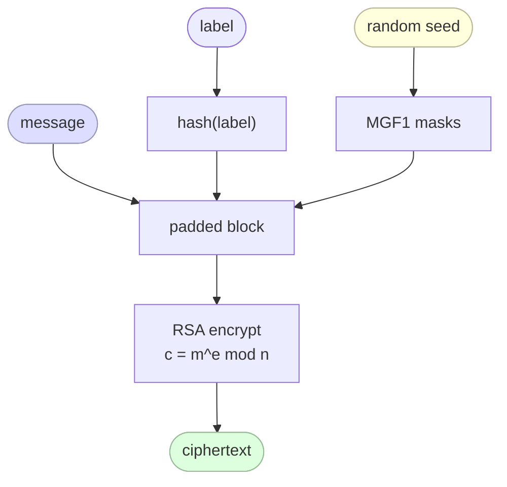
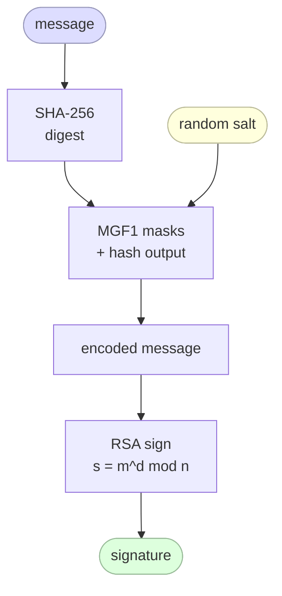

## RSA Algorithm

RSA (Rivest–Shamir–Adleman)[^rsa][^rsa_paper] is one of the oldest and most widely used asymmetric cryptographic algorithms. Unlike symmetric algorithms, which use the same key for both encryption and decryption, RSA uses a **key pair**: a **public key** that anyone can know, and a **private key** that must remain secret. The idea of public-key cryptography itself was introduced by Diffie and Hellman in 1976[^dh_paper].

Its security rests on a simple mathematical asymmetry: multiplying two large prime numbers together is fast, but factoring the result back into those primes is computationally infeasible at sufficient key sizes (2048-bit or larger).

RSA is foundational to many protocols you already use, including TLS/HTTPS[^rfc8446], SSH[^rfc4253], PGP[^rfc4880], and JWT signing with `RS256`[^rfc7518].

---

## Core Concepts

### Key Pair

| Key | Who holds it | Purpose |
|---|---|---|
| Public key `(e, n)` | Anyone | Encrypt data or verify a signature |
| Private key `(d, n)` | Owner only | Decrypt data or create a signature |

The two keys are mathematically linked: a message encrypted with the public key can **only** be decrypted with the corresponding private key, and vice versa.

### Mathematical Foundation

RSA is built on **modular arithmetic** and **Euler's theorem**[^euler]. The key steps are:

1. Choose two large prime numbers `p` and `q`.
2. Compute `n = p × q` (the **modulus**, public).
3. Compute Euler's totient: `φ(n) = (p − 1)(q − 1)`.
4. Choose `e` such that `1 < e < φ(n)` and `gcd(e, φ(n)) = 1` (commonly `e = 65537`).
5. Compute `d` as the modular inverse of `e` modulo `φ(n)`, i.e. `d × e ≡ 1 (mod φ(n))`.

The public key is `(e, n)`. The private key is `(d, n)`. The primes `p` and `q` are discarded after key generation.

### Encryption & Decryption

Given a message `m` (as an integer, where `m < n`):

- **Encrypt:** `c = m^e mod n`
- **Decrypt:** `m = c^d mod n`

The correctness follows from Euler's theorem: `(m^e)^d ≡ m (mod n)`.

### Digital Signatures

RSA can also be used to **sign** data, reversing the role of the keys:

- **Sign** (with private key): `s = m^d mod n`
- **Verify** (with public key): check that `s^e mod n = m`

This is how JWT tokens signed with `RS256` work: the server signs the token with its private key; any client holding the public key can verify it without being able to forge a new one.

---

## Why Not Use RSA for Everything?

RSA is slow compared to symmetric algorithms like AES. In practice, RSA is used only to **exchange or protect a symmetric key** (a pattern called *hybrid encryption*). The symmetric key then handles the bulk of the data encryption. TLS does exactly this.

Additionally, raw RSA without padding is insecure. Modern usage requires padding schemes such as **OAEP** (for encryption) or **PSS** (for signatures).

---

## Padding Schemes

Raw RSA — applying the mathematical formula directly to a message — is **textbook RSA** and is broken in practice. Without padding, it leaks structure: encrypting the same message always produces the same ciphertext, and an attacker can manipulate ciphertexts algebraically. Two standardised padding schemes fix this, one for each use case.

### OAEP — Optimal Asymmetric Encryption Padding

OAEP (defined in PKCS#1 v2 / RFC 8017[^rfc8017], originally proposed by Bellare and Rogaway[^oaep_paper]) is the correct padding to use when **encrypting** data with RSA. Before the modular exponentiation, the plaintext is combined with a random seed through a pair of mask generation functions (MGF1, typically built on SHA-256):



Key properties:

- **Randomised** — encrypting the same plaintext twice produces different ciphertexts, preventing pattern analysis.
- **All-or-nothing** — a single flipped bit in the ciphertext causes decryption to fail completely rather than silently producing garbled output.
- **IND-CCA2 secure** — resistant to chosen-ciphertext attacks in the random-oracle model.

!!! warning "Never use PKCS#1 v1.5 encryption padding"

    The older `PKCS1v15` encryption padding is vulnerable to Bleichenbacher's attack (1998)[^bleichenbacher][^bleichenbacher_paper] and its many descendants. Always use OAEP for new systems.

### PSS — Probabilistic Signature Scheme

PSS (also defined in PKCS#1 v2 / RFC 8017[^rfc8017], introduced by Bellare and Rogaway[^pss_paper]) is the correct padding to use when **signing** data with RSA. It works similarly — a random salt is hashed together with the message digest before the private-key operation — making each signature unique even for the same message.



Key properties:

- **Randomised** — the salt means that signing the same message twice gives different signatures, unlike the deterministic `PKCS1v15` signature scheme.
- **Tight security proof** — PSS has a provable reduction to the hardness of RSA, whereas PKCS#1 v1.5 signatures do not.
- **Standard identifiers** — `RS256` (PKCS#1 v1.5) vs. `PS256` (PSS with SHA-256) in JWT; prefer `PS256` for new systems.

---

## Ed25519 — A Modern Alternative

Ed25519[^ed25519][^eddsa_paper] is an **elliptic-curve signature algorithm** based on the Edwards curve `Curve25519`[^curve25519][^curve25519_paper], standardised in RFC 8032[^rfc8032]. It is not RSA, but it serves the same purpose — asymmetric digital signatures — and is increasingly the preferred choice in modern protocols.

### Why Elliptic Curves?

RSA's security comes from the difficulty of integer factorisation[^factoring]. Elliptic-curve cryptography (ECC)[^ecc] uses a different hard problem: the **elliptic-curve discrete logarithm problem (ECDLP)**. ECDLP is harder per bit, which means much smaller keys can achieve the same security level:

| Algorithm | Key size | Equivalent symmetric strength |
|---|---|---|
| RSA | 2048-bit | ~112-bit |
| RSA | 3072-bit | ~128-bit |
| Ed25519 | 256-bit | ~128-bit |
| Ed25519 | 256-bit | ~128-bit |

A 256-bit Ed25519 key is roughly equivalent in security to a 3072-bit RSA key, while being far smaller and faster.

### How Ed25519 Works

Ed25519 is defined over the **twisted Edwards curve**:

```
-x² + y² = 1 − (121665/121666)·x²·y²  (mod p),   p = 2²⁵⁵ − 19
```

Key generation:

1. Choose a 32-byte random private key `k`.
2. Hash `k` with SHA-512 to produce a 64-byte seed; the lower 32 bytes are clamped and used as the scalar `a`.
3. The public key is the curve point `A = a · B`, where `B` is the curve's base point.

Signing a message `m`:

1. Derive a deterministic nonce `r = hash(second_half_of_seed || m)`.
2. Compute `R = r · B`.
3. Compute `S = (r + hash(R || A || m) · a) mod ℓ`, where `ℓ` is the curve order.
4. The signature is `(R, S)` — 64 bytes total.

Verification checks that `S · B == R + hash(R || A || m) · A`.

### Key Advantages over RSA

| Property | RSA (2048-bit) | Ed25519 |
|---|---|---|
| Key size | 2048 bits | 256 bits |
| Signature size | 256 bytes | 64 bytes |
| Key generation | Slow (prime search) | Fast (random scalar) |
| Signing speed | Moderate | Very fast |
| Verification speed | Fast | Very fast |
| Deterministic signatures | No (PSS uses salt) | Yes (nonce derived from key+message) |
| Side-channel resistance | Requires care | Built into the design |
| Padding complexity | Required (OAEP/PSS) | None needed |

### Determinism — a Double-Edged Sword

Ed25519 signatures are **deterministic**: the nonce `r` is derived from the private key and the message, not from an external random source. This eliminates an entire class of catastrophic bugs — notably the Sony PlayStation 3 ECDSA failure[^ps3], where a constant nonce exposed the private key. The downside is that if the hash function is broken, determinism could theoretically help an attacker; in practice this is not a concern for SHA-512.

### Where Ed25519 Is Used

- **SSH** — `ssh-keygen -t ed25519` is now the recommended key type[^rfc4253].
- **TLS 1.3** — supported as a signature algorithm[^rfc8446].
- **JWT** — `EdDSA` algorithm identifier (`alg: "EdDSA"` with `crv: "Ed25519"`)[^rfc7518][^rfc8037].
- **Git** — GPG commit signing via an Ed25519 subkey.
- **Signal, WireGuard, age** — all use Curve25519-family keys.

!!! tip "Which should you use?"

    - Use **Ed25519** for new systems whenever possible — smaller keys, faster operations, no padding to misconfigure.
    - Use **RSA + PSS** when interoperating with legacy systems that do not support ECC, and always with 2048-bit or larger keys.
    - Avoid raw RSA, PKCS#1 v1.5 encryption padding, and 1024-bit or smaller keys entirely.

---

## Generating the RSA Keys

=== "Part 1"

    :fontawesome-brands-youtube:{ .youtube } [The RSA Encryption Algorithm (1 of 2: Generating the Keys)](https://youtu.be/4zahvcJ9glg){target="_blank"}

    [{ width=90% }](https://youtu.be/4zahvcJ9glg){target="_blank"}

=== "Part 2"

    :fontawesome-brands-youtube:{ .youtube } [The RSA Encryption Algorithm (2 of 2: Generating the Keys)](https://youtu.be/oOcTVTpUsPQ){target="_blank"}

    [{ width=90% }](https://youtu.be/oOcTVTpUsPQ){target="_blank"}


[^rsa]: [RSA cryptosystem — Wikipedia](https://en.wikipedia.org/wiki/RSA_(cryptosystem)){target="_blank"}
[^euler]: [Euler's theorem — Wikipedia](https://en.wikipedia.org/wiki/Euler%27s_theorem){target="_blank"}
[^bleichenbacher]: [Bleichenbacher's attack — Wikipedia](https://en.wikipedia.org/wiki/Adaptive_chosen-ciphertext_attack#Bleichenbacher's_attack_on_PKCS1_v1.5){target="_blank"}
[^curve25519]: [Curve25519 — Wikipedia](https://en.wikipedia.org/wiki/Curve25519){target="_blank"}
[^ed25519]: [EdDSA / Ed25519 — Wikipedia](https://en.wikipedia.org/wiki/EdDSA){target="_blank"}
[^ecc]: [Elliptic-curve cryptography — Wikipedia](https://en.wikipedia.org/wiki/Elliptic-curve_cryptography){target="_blank"}
[^factoring]: [Integer factorization — Wikipedia](https://en.wikipedia.org/wiki/Integer_factorization){target="_blank"}

[^rsa_paper]: R.L. Rivest, A. Shamir, L. Adleman. "A Method for Obtaining Digital Signatures and Public-Key Cryptosystems." *Communications of the ACM*, 21(2):120–126, 1978. [ACM DL](https://dl.acm.org/doi/10.1145/359340.359342){target="_blank"}
[^dh_paper]: W. Diffie, M.E. Hellman. "New Directions in Cryptography." *IEEE Transactions on Information Theory*, 22(6):644–654, 1976. [PDF](https://ee.stanford.edu/~hellman/publications/24.pdf){target="_blank"}
[^oaep_paper]: M. Bellare, P. Rogaway. "Optimal Asymmetric Encryption." *EUROCRYPT 1994*, LNCS 950, pp. 92–111. [PDF](https://cseweb.ucsd.edu/~mihir/papers/oae.pdf){target="_blank"}
[^pss_paper]: M. Bellare, P. Rogaway. "The Exact Security of Digital Signatures – How to Sign with RSA and Rabin." *EUROCRYPT 1996*, LNCS 1070, pp. 399–416. [PDF](https://cseweb.ucsd.edu/~mihir/papers/pss.pdf){target="_blank"}
[^bleichenbacher_paper]: D. Bleichenbacher. "Chosen Ciphertext Attacks Against Protocols Based on the RSA Encryption Standard PKCS #1." *CRYPTO 1998*, LNCS 1462, pp. 1–12. [PDF](https://archiv.infsec.ethz.ch/education/fs08/secsem/bleichenbacher98.pdf){target="_blank"}
[^curve25519_paper]: D.J. Bernstein. "Curve25519: New Diffie-Hellman Speed Records." *PKC 2006*, LNCS 3958, pp. 207–228. [PDF](https://cr.yp.to/ecdh/curve25519-20060209.pdf){target="_blank"}
[^eddsa_paper]: D.J. Bernstein, N. Duif, T. Lange, P. Schwabe, B.-Y. Yang. "High-Speed High-Security Signatures." *CHES 2011*, LNCS 6917, pp. 124–142. [PDF](https://ed25519.cr.yp.to/ed25519-20110926.pdf){target="_blank"}
[^ps3]: fail0verflow. "Console Hacking 2010: PS3 Epic Fail." 27th Chaos Communication Congress, 2010. [PDF](https://fahrplan.events.ccc.de/congress/2010/Fahrplan/attachments/1780_27c3_console_hacking_2010.pdf){target="_blank"}

[^rfc8017]: [RFC 8017 — PKCS #1: RSA Cryptography Specifications v2.2](https://datatracker.ietf.org/doc/html/rfc8017){target="_blank"}
[^rfc8032]: [RFC 8032 — Edwards-Curve Digital Signature Algorithm (EdDSA)](https://datatracker.ietf.org/doc/html/rfc8032){target="_blank"}
[^rfc8037]: [RFC 8037 — CFRG Elliptic Curves for JOSE (OKP key type, Ed25519)](https://datatracker.ietf.org/doc/html/rfc8037){target="_blank"}
[^rfc7518]: [RFC 7518 — JSON Web Algorithms (JWA)](https://datatracker.ietf.org/doc/html/rfc7518){target="_blank"}
[^rfc8446]: [RFC 8446 — The Transport Layer Security (TLS) Protocol Version 1.3](https://datatracker.ietf.org/doc/html/rfc8446){target="_blank"}
[^rfc4253]: [RFC 4253 — The Secure Shell (SSH) Transport Layer Protocol](https://datatracker.ietf.org/doc/html/rfc4253){target="_blank"}
[^rfc4880]: [RFC 4880 — OpenPGP Message Format](https://datatracker.ietf.org/doc/html/rfc4880){target="_blank"}

[^ecdsa_video]: :simple-youtube: [ECDSA Signatures | How does ECDSA work and what are Elliptic Curves?](https://www.youtube.com/watch?v=e3ugVpBBlhc){target="_blank"}

[^eddsa_video]: :simple-youtube: [Ed25519 Signature Schemes: Theory and Practice](https://www.youtube.com/watch?v=9w7ajCIWg-g){target="_blank"}

[^elliptic_curves]: :simple-youtube: [Elliptic Curves - Computerphile](https://www.youtube.com/watch?v=NF1pwjL9-DE){target="_blank"}