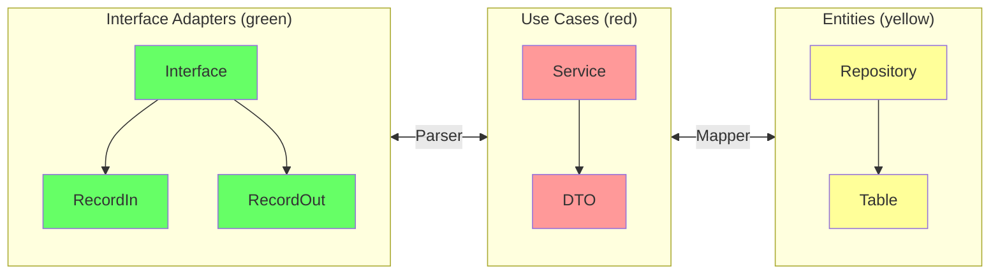

[Clean Architecture](https://blog.cleancoder.com/uncle-bob/2012/08/13/the-clean-architecture.html){:target="_blank"} was proposed by Robert C. Martin (Uncle Bob) as a synthesis of several earlier layered-architecture ideas — Hexagonal, Onion, and BCE. Its central rule is the **Dependency Rule**: source-code dependencies must always point *inward*, toward higher-level policy[^1].

<figure markdown>
  { width="80%" }
  <figcaption><i>Source: <a href="https://blog.cleancoder.com/uncle-bob/2012/08/13/the-clean-architecture.html" target="_blank">The Clean Code Blog — Robert C. Martin</a></i></figcaption>
</figure>

---

## Layers

| Layer | Also called | Responsibility |
|---|---|---|
| **Entities** | Domain | Enterprise-wide business rules and data structures. Independent of any application. |
| **Use Cases** | Application | Application-specific business rules. Orchestrates Entities; defines what the app *does*. |
| **Interface Adapters** | Adapters | Converts data between Use Cases and external formats: Controllers, Presenters, Gateways. |
| **Frameworks & Drivers** | Infrastructure | Web frameworks, databases, UI, external APIs. The outermost ring — all detail lives here. |

!!! info "The Dependency Rule"
    Nothing in an inner layer may reference anything in an outer layer. Data that crosses boundaries must be in simple structures — plain objects or records — **never** a framework type. An `@Entity` annotation or `HttpServletRequest` must never appear inside a Use Case or Entity class.

### What belongs where

A practical heuristic for deciding which layer a class belongs to:

- **If it changes when the business changes** → Entity or Use Case
- **If it changes when the interface changes** (REST → gRPC, JSON → XML) → Interface Adapter
- **If it changes when a library is upgraded** (Spring Boot version, JPA dialect) → Frameworks & Drivers

---

## In our architecture

The diagram below shows how Clean Architecture layers map to the classes and packages used in the course's Spring Boot microservices:



### Role of each component

**`RecordIn` / `RecordOut`**
: Input/output DTOs that live at the adapter boundary. They decouple the HTTP contract from the internal model, so changing a JSON field name or adding a validation annotation never touches the Use Case.

**`Parser`**
: Converts between `Record*` types and the Use Case DTOs. It is the only place that knows both worlds — keeping both sides of the boundary clean.

**`Service`**
: Implements the use-case logic. It depends only on repository *interfaces* declared in the Entities layer, never on JPA, Spring Data, or any other persistence detail.

**`Mapper`**
: Converts between Use Case DTOs and `@Entity` / `@Table` objects at the persistence boundary. The `@Entity` class — which carries ORM annotations — is confined to the Entities/Infrastructure boundary and never leaks into Service logic.

**`Repository`**
: A plain Java interface declared in the Entities layer. The JPA implementation (`AccountJpaAdapter`) lives in the outermost layer and is injected at runtime by Spring's dependency injection container.

### Suggested package layout

```
com.example.product/
├── domain/                  ← Entities layer
│   ├── Product.java         # Domain object (no framework annotations)
│   └── ProductRepository.java  # Repository interface (port)
├── application/             ← Use Cases layer
│   ├── ProductService.java  # Business logic
│   └── ProductDTO.java      # Data passed across the use-case boundary
├── adapter/                 ← Interface Adapters layer
│   ├── in/
│   │   ├── ProductController.java
│   │   ├── ProductRecordIn.java
│   │   └── ProductRecordOut.java
│   └── out/
│       ├── ProductJpaAdapter.java   # Implements ProductRepository
│       ├── ProductTable.java        # @Entity class
│       └── ProductMapper.java
```

---

## Practical benefits

**Testability without infrastructure**
: Business rules in the Use Case layer can be unit-tested with plain JUnit — no Spring context, no database, no web server. Mock the `Repository` interface and test the `Service` in milliseconds.

**Swappable delivery mechanism**
: The HTTP layer (REST, gRPC, GraphQL, CLI) can be swapped or run in parallel without touching the `Service` class. The adapter is the only thing that changes.

**Swappable persistence**
: Replace JPA with MongoDB, or an in-memory map for tests, by providing a new implementation of the `Repository` interface. The domain and application layers are unaffected.

**Parallel team work**
: Teams can develop the persistence adapter and the REST adapter independently, as long as they agree on the port interfaces. The `Service` can be developed — and fully tested — before any adapter exists.

---

## Common mistakes

!!! warning "Leaking framework types inward"
    Putting `@Entity`, `@Column`, `@JsonProperty`, or `HttpServletRequest` into a Use Case or Entity class violates the Dependency Rule immediately. The framework detail now dictates what the business rule looks like.

!!! warning "Fat controllers"
    Controllers that contain `if` statements, call multiple services, or orchestrate workflows have absorbed Use Case responsibilities. Controllers should translate and delegate — nothing more.

!!! warning "Anemic domain model"
    Entities that are pure data bags (only getters/setters) with all logic in the Service layer are a sign the layer boundary is not being used. Move invariant enforcement into the Entity.

---

[^1]: MARTIN, R. C. *Clean Architecture: A Craftsman's Guide to Software Structure and Design*. Prentice Hall, 2017. [:fontawesome-brands-amazon:](https://www.amazon.com.br/Clean-Architecture-Craftsmans-Software-Structure/dp/B075LRM681/){:target='_blank'}

[^2]: :fontawesome-brands-youtube:{ .youtube } [Criando um projeto Spring Boot com Arquitetura Limpa](https://youtu.be/hit0XHGt4WI){:target="_blank"} by [Giuliana Silva Bezerra](https://github.com/giuliana-bezerra){:target="_blank"}
