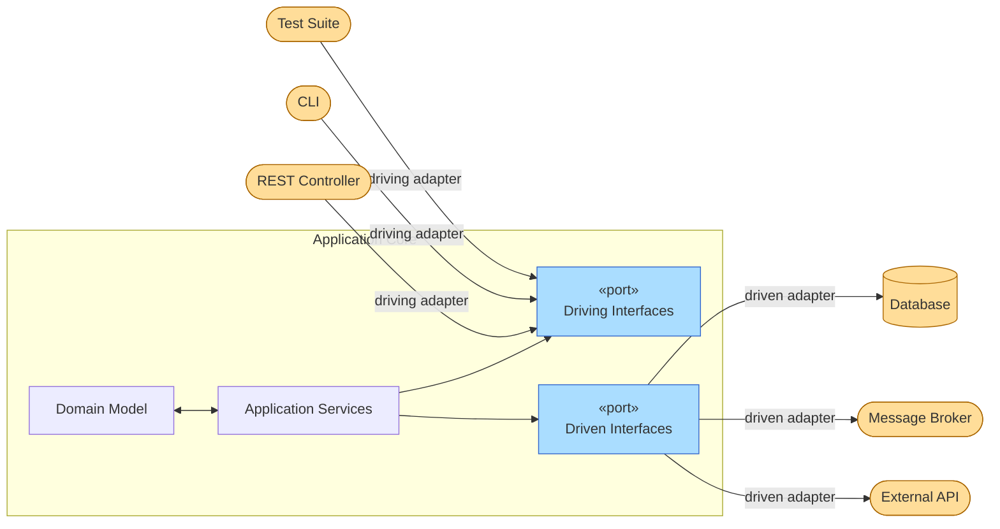

[Hexagonal Architecture](https://alistair.cockburn.us/hexagonal-architecture/){:target="_blank"} — also called **Ports & Adapters** — was introduced by Alistair Cockburn in 2005. The idea is to place the application core at the centre and expose it through *ports* (interfaces), which external *adapters* connect to. The hexagon shape is arbitrary; it signals that the application has multiple equivalent entry/exit points with no privileged side[^1].



---

## Ports

A **port** is a pure interface — a contract defined *by* the application core, not by the external technology. There are two kinds:

| Type | Direction | Defined by | Implemented by | Example |
|---|---|---|---|---|
| **Primary / Driving port** | Outside → App | The application | The application itself | `AuthService` interface called by the REST controller |
| **Secondary / Driven port** | App → Outside | The application | An external adapter | `AccountRepository` implemented by JPA adapter |

!!! info "Ownership matters"
    Both port types are *owned and defined by the application core*. The adapter is the piece that lives outside and plugs into the port — **the core never imports the adapter**.

### Primary (driving) ports

Primary ports represent *what the application can do* — they are the use-case API. Any external actor that wants to interact with the application must go through a primary port.

```java
// Defined inside the application core
public interface AuthService {
    TokenOut login(String email, String password);
    void logout(String token);
}
```

The implementation of this interface also lives inside the core — it is the application service:

```java
// Also inside the core — depends only on secondary ports
public class AuthServiceImpl implements AuthService {
    private final AccountRepository accounts; // ← secondary port

    @Override
    public TokenOut login(String email, String password) {
        Account account = accounts.findByEmail(email)
            .orElseThrow(() -> new InvalidCredentialsException());
        account.validatePassword(password);
        return TokenOut.issue(account);
    }
}
```

### Secondary (driven) ports

Secondary ports represent *what the application needs* from the outside world — persistence, messaging, external APIs. The core defines the interface; the infrastructure provides the implementation.

```java
// Defined inside the application core
public interface AccountRepository {
    Optional<Account> findByEmail(String email);
    Account save(Account account);
}
```

---

## Adapters

An adapter is a class that **translates** between an external technology and a port contract. It lives outside the core and depends on it — never the reverse.

=== "Driving adapter (REST)"

    ```java
    // Adapter: translates HTTP → primary port
    @RestController
    public class AuthController {
        private final AuthService authService; // ← primary port

        public AuthController(AuthService authService) {
            this.authService = authService;
        }

        @PostMapping("/auth/login")
        public ResponseEntity<TokenOut> login(@RequestBody LoginIn in) {
            TokenOut token = authService.login(in.email(), in.password());
            return ResponseEntity.ok(token);
        }
    }
    ```

=== "Driving adapter (CLI)"

    ```java
    // Any driver can plug into the same primary port
    public class AuthCLI {
        private final AuthService authService;

        public void run(String[] args) {
            String email = args[0], password = args[1];
            TokenOut token = authService.login(email, password);
            System.out.println("Token: " + token.value());
        }
    }
    ```

=== "Driven adapter (JPA)"

    ```java
    // Adapter: translates secondary port → JPA
    @Repository
    public class AccountJpaAdapter implements AccountRepository {

        private final AccountJpaRepository jpa;

        @Override
        public Optional<Account> findByEmail(String email) {
            return jpa.findByEmail(email).map(AccountMapper::toDomain);
        }

        @Override
        public Account save(Account account) {
            AccountTable table = AccountMapper.toTable(account);
            return AccountMapper.toDomain(jpa.save(table));
        }
    }
    ```

=== "Driven adapter (in-memory / test)"

    ```java
    // Swap the JPA adapter for a map in tests — no Spring context needed
    public class InMemoryAccountRepository implements AccountRepository {
        private final Map<String, Account> store = new HashMap<>();

        @Override
        public Optional<Account> findByEmail(String email) {
            return Optional.ofNullable(store.get(email));
        }

        @Override
        public Account save(Account account) {
            store.put(account.email(), account);
            return account;
        }
    }
    ```

<figure markdown>
  { width="80%" }
  <figcaption><i>Source: <a href="https://en.wikipedia.org/wiki/Hexagonal_architecture_(software)" target="_blank">Wikipedia — Hexagonal Architecture</a></i></figcaption>
</figure>

---

## Full working example

The files below show the complete authentication slice of the `auth-service`. Each file is annotated with its location relative to the hexagon boundary.

=== "AuthService.java — primary port"

    ``` { .java .copy .select linenums="1" }
    --8<-- "docs/classes/architectures/hexagonal/examples/AuthService.java"
    ```

=== "AuthServiceImpl.java — core implementation"

    ``` { .java .copy .select linenums="1" }
    --8<-- "docs/classes/architectures/hexagonal/examples/AuthServiceImpl.java"
    ```

=== "AccountRepository.java — secondary port"

    ``` { .java .copy .select linenums="1" }
    --8<-- "docs/classes/architectures/hexagonal/examples/AccountRepository.java"
    ```

=== "AuthController.java — driving adapter"

    ``` { .java .copy .select linenums="1" }
    --8<-- "docs/classes/architectures/hexagonal/examples/AuthController.java"
    ```

=== "AccountJpaAdapter.java — driven adapter"

    ``` { .java .copy .select linenums="1" }
    --8<-- "docs/classes/architectures/hexagonal/examples/AccountJpaAdapter.java"
    ```

=== "InMemoryAccountRepository.java — test adapter"

    ``` { .java .copy .select linenums="1" }
    --8<-- "docs/classes/architectures/hexagonal/examples/InMemoryAccountRepository.java"
    ```

---

## Testing strategy

The key testing insight of Hexagonal Architecture is that the **application core can be fully tested without any infrastructure**. Replace every driven adapter with an in-memory stub; drive the primary port directly from a test.


``` { .java .copy .select linenums="1" title="AuthServiceTest.java" }
--8<-- "docs/classes/architectures/hexagonal/examples/AuthServiceTest.java"
```

No Spring `@SpringBootTest`, no H2, no port 8080 — the test runs in milliseconds and covers the business rule directly.

---

## Suggested package layout

```
com.example.auth/
├── domain/                         ← Domain Model
│   └── Account.java                # Aggregate root — no framework annotations
├── application/                    ← Application Services + Ports
│   ├── AuthService.java            # Primary port (interface)
│   ├── AuthServiceImpl.java        # Primary port implementation
│   └── port/
│       └── AccountRepository.java  # Secondary port (interface)
├── adapter/
│   ├── in/
│   │   └── AuthController.java     # Driving adapter (REST)
│   └── out/
│       ├── AccountJpaAdapter.java  # Driven adapter (JPA)
│       ├── AccountTable.java       # @Entity — stays in the adapter
│       └── AccountMapper.java
```

---

## Common mistakes

!!! warning "Ports defined by the adapter"
    If the `AccountRepository` interface mirrors the Spring Data `JpaRepository` method names, it is being shaped by JPA rather than by the application's needs. Define ports in terms of domain concepts, not persistence concepts.

!!! warning "The core importing the adapter"
    Any `import com.example.adapter.*` inside the domain or application package is an immediate violation. Dependency injection (Spring, CDI) should resolve the adapter at runtime, not at compile time.

!!! warning "Too many ports"
    One port per use case leads to interface explosion. Group related operations — `AccountRepository` is one port, not separate ports for `findByEmail`, `save`, and `delete`.

---

[^1]: COCKBURN, A. [Hexagonal Architecture](https://alistair.cockburn.us/hexagonal-architecture/){:target="_blank"}, 2005.

[^2]: :fontawesome-brands-youtube:{ .youtube } [Hexagonal Architecture — What Is It? Why Should You Use It?](https://www.youtube.com/watch?v=bDWApqAUjEI){:target="_blank"} by CodeOpinion

[^3]: :fontawesome-brands-youtube:{ .youtube } [Arquitetura Hexagonal na Prática | Arquitetura com Java e Spring Boot](https://www.youtube.com/watch?v=UKSj5VJEzps){:target="_blank"} by Fernanda Kipper
