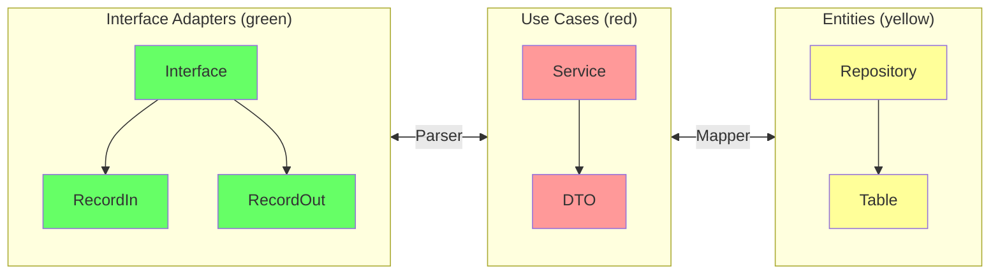
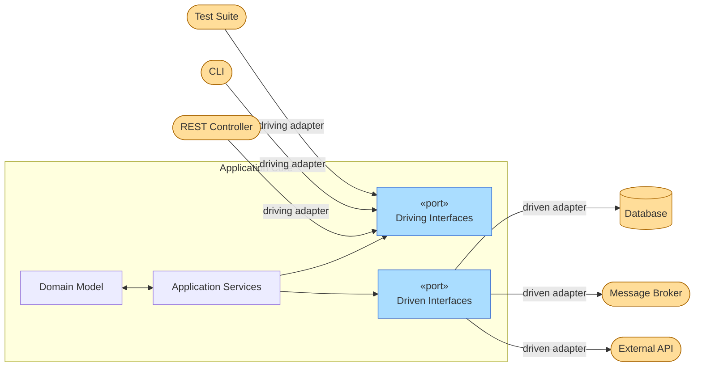

Software architecture defines how the components of a system are organised, how they communicate, and — most importantly — which components are allowed to know about which others. The two architectures covered here both share the same core goal: **protect business logic from external concerns** such as frameworks, databases, and delivery mechanisms.

## Clean Architecture

[Clean Architecture](https://blog.cleancoder.com/uncle-bob/2012/08/13/the-clean-architecture.html){:target="_blank"} was proposed by Robert C. Martin (Uncle Bob) as a synthesis of several earlier layered-architecture ideas (Hexagonal, Onion, BCE). Its central rule is the **Dependency Rule**: source-code dependencies must always point *inward*, toward higher-level policy[^1].

<figure markdown>
  { width="80%" }
  <figcaption><i>Source: <a href="https://blog.cleancoder.com/uncle-bob/2012/08/13/the-clean-architecture.html" target="_blank">The Clean Code Blog — Robert C. Martin</a></i></figcaption>
</figure>

### Layers

| Layer | Also called | Responsibility |
|---|---|---|
| **Entities** | Domain | Enterprise-wide business rules and data structures |
| **Use Cases** | Application | Application-specific business rules; orchestrates Entities |
| **Interface Adapters** | Adapters | Converts data between Use Cases and external formats (Controllers, Presenters, Gateways) |
| **Frameworks & Drivers** | Infrastructure | Web frameworks, databases, UI, external APIs |

!!! info "The Dependency Rule"
    Nothing in an inner layer may reference anything in an outer layer. Data that crosses boundaries must be in simple structures (plain objects or records) — **never** a framework type.

### In our architecture

The diagram below shows how the Clean Architecture layers map to the classes and packages used in the project's Spring Boot microservices:



- **`RecordIn` / `RecordOut`** — input/output DTOs that live at the adapter boundary; they decouple the HTTP contract from the internal model.
- **`Parser`** — converts between `Record*` types and the Use Case DTOs without leaking framework annotations inward.
- **`Service`** — implements the use-case logic; it depends only on repository *interfaces*, never on JPA or any other persistence detail.
- **`Mapper`** — converts between Use Case DTOs and `@Entity` / `@Table` objects at the persistence boundary.
- **`Repository`** — a Spring Data interface declared in the Entities layer; the JPA implementation lives in the outermost layer.

### Practical benefits

- Business rules can be tested without starting a Spring context, a database, or a web server.
- The HTTP layer (REST, gRPC, GraphQL) can be swapped without touching the `Service` class.
- The persistence layer (JPA, MongoDB, in-memory) can be replaced by providing a new `Repository` implementation.

---

## Hexagonal Architecture

[Hexagonal Architecture](https://alistair.cockburn.us/hexagonal-architecture/){:target="_blank"} — also called **Ports & Adapters** — was introduced by Alistair Cockburn in 2005. The idea is to place the application core at the centre and expose it through *ports* (interfaces), which external *adapters* connect to. The hexagon shape is arbitrary; it simply signals that the application has multiple equivalent entry/exit points with no privileged side[^2].



### Ports

| Type | Direction | Defined by | Example |
|---|---|---|---|
| **Primary / Driving port** | Outside → App | The application | `AuthService` interface called by the REST controller |
| **Secondary / Driven port** | App → Outside | The application | `AccountRepository` interface implemented by JPA adapter |

Both port types are *owned* by the application core. The adapter is the piece that lives outside and plugs into the port — the core never imports the adapter.

### Adapters

An adapter translates between the external technology and the port contract:

=== "Driving adapter (REST)"

    ```java
    // Adapter: translates HTTP → port
    @RestController
    public class AuthController {
        private final AuthService authService; // ← primary port

        public AuthController(AuthService authService) {
            this.authService = authService;
        }

        @PostMapping("/auth/login")
        public TokenOut login(@RequestBody LoginIn in) {
            return authService.login(in.email(), in.password());
        }
    }
    ```

=== "Driven adapter (JPA)"

    ```java
    // Adapter: translates port → JPA
    @Repository
    public class AccountJpaAdapter implements AccountRepository { // ← secondary port

        private final AccountJpaRepository jpa;

        @Override
        public Optional<Account> findByEmail(String email) {
            return jpa.findByEmail(email).map(AccountMapper::toDomain);
        }
    }
    ```


<figure markdown>
  { width="80%" }
  <figcaption><i>Source: <a href="https://en.wikipedia.org/wiki/Hexagonal_architecture_(software)" target="_blank">Wikipedia - Hexagonal Architecture</a></i></figcaption>
</figure>

### Comparison

| Concern | Clean Architecture | Hexagonal Architecture |
|---|---|---|
| Core abstraction | Concentric layers + Dependency Rule | Hexagon + Ports & Adapters |
| Dependency direction | Always inward | Always toward the core |
| Testing | Inner layers testable in isolation | Core testable by substituting adapters |
| Flexibility | Framework/DB can be swapped | Any external system can be swapped |
| Relationship | Incorporates Hexagonal ideas | Clean Architecture is a superset |

!!! tip "Which to use?"
    The two architectures are highly complementary and commonly used together. Think of Hexagonal as defining *how* the application boundary works (ports & adapters), and Clean Architecture as defining *what* goes inside (layers with explicit policies). Most modern microservices combine both.

---

[^1]: MARTIN, R. C. *Clean Architecture: A Craftsman's Guide to Software Structure and Design*. Prentice Hall, 2017. [:fontawesome-brands-amazon:](https://www.amazon.com.br/Clean-Architecture-Craftsmans-Software-Structure/dp/B075LRM681/){:target='_blank'}

[^2]: COCKBURN, A. [Hexagonal Architecture](https://alistair.cockburn.us/hexagonal-architecture/){:target="_blank"}, 2005.

[^3]: :fontawesome-brands-youtube:{ .youtube } [Criando um projeto Spring Boot com Arquitetura Limpa](https://youtu.be/hit0XHGt4WI){:target="_blank"} by [Giuliana Silva Bezerra](https://github.com/giuliana-bezerra){:target="_blank"}

[^4]: :fontawesome-brands-youtube:{ .youtube } [Hexagonal Architecture — What Is It? Why Should You Use It?](https://www.youtube.com/watch?v=bDWApqAUjEI){:target="_blank"} by CodeOpinion

[^5]: :fontawesome-brands-youtube:{ .youtube } [Arquitetura Hexagonal na Prática | Arquitetura com Java e Spring Boot](https://www.youtube.com/watch?v=UKSj5VJEzps){:target="_blank"} by Fernanda Kipper.
