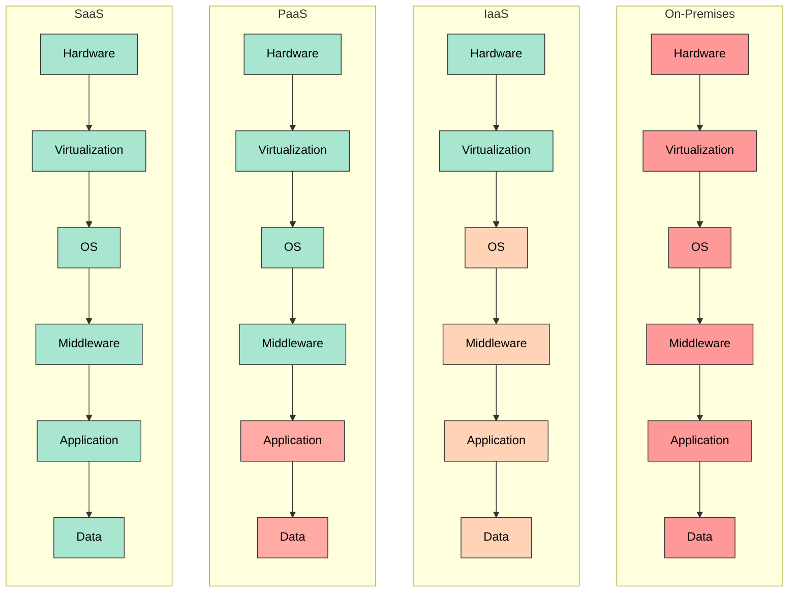

```mermaid
graph TD
    subgraph On-Premises
        direction TB
        A1[Hardware] --> A2[Virtualization]
        A2 --> A3[OS]
        A3 --> A4[Middleware]
        A4 --> A5[Application]
        A5 --> A6[Data]
        style A1 fill:#ff9999,stroke:#333
        style A2 fill:#ff9999,stroke:#333
        style A3 fill:#ff9999,stroke:#333
        style A4 fill:#ff9999,stroke:#333
        style A5 fill:#ff9999,stroke:#333
        style A6 fill:#ff9999,stroke:#333
    end

    subgraph IaaS
        direction TB
        B1[Hardware] --> B2[Virtualization]
        B2 --> B3[OS]
        B3 --> B4[Middleware]
        B4 --> B5[Application]
        B5 --> B6[Data]
        style B1 fill:#a8e6cf,stroke:#333
        style B2 fill:#a8e6cf,stroke:#333
        style B3 fill:#ffd3b6,stroke:#333
        style B4 fill:#ffd3b6,stroke:#333
        style B5 fill:#ffd3b6,stroke:#333
        style B6 fill:#ffd3b6,stroke:#333
    end

    subgraph PaaS
        direction TB
        C1[Hardware] --> C2[Virtualization]
        C2 --> C3[OS]
        C3 --> C4[Middleware]
        C4 --> C5[Application]
        C5 --> C6[Data]
        style C1 fill:#a8e6cf,stroke:#333
        style C2 fill:#a8e6cf,stroke:#333
        style C3 fill:#a8e6cf,stroke:#333
        style C4 fill:#a8e6cf,stroke:#333
        style C5 fill:#ffaaa5,stroke:#333
        style C6 fill:#ffaaa5,stroke:#333
    end

    subgraph SaaS
        direction TB
        D1[Hardware] --> D2[Virtualization]
        D2 --> D3[OS]
        D3 --> D4[Middleware]
        D4 --> D5[Application]
        D5 --> D6[Data]
        style D1 fill:#a8e6cf,stroke:#333
        style D2 fill:#a8e6cf,stroke:#333
        style D3 fill:#a8e6cf,stroke:#333
        style D4 fill:#a8e6cf,stroke:#333
        style D5 fill:#a8e6cf,stroke:#333
        style D6 fill:#a8e6cf,stroke:#333
    end

    %% Legend
    classDef provider fill:#a8e6cf,stroke:#333,color:#000
    classDef user fill:#ffd3b6,stroke:#333,color:#000
    classDef saas fill:#ffaaa5,stroke:#333,color:#000
    class B1,B2,C1,C2,C3,C4,D1,D2,D3,D4,D5,D6 provider
    class B3,B4,B5,B6,C5,C6 user
    class A1,A2,A3,A4,A5,A6 user
```
