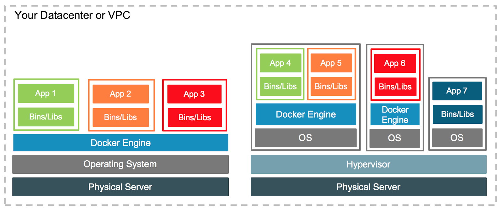
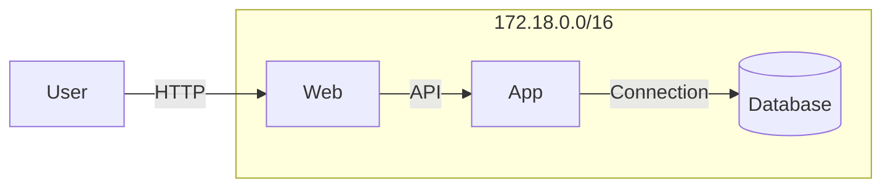

When a server has so much traffic that it cannot handle it, the solution is to add more servers or increase the capacity of existing ones. This is called **scalability**.

The scalability could be achieved:

- by adding more servers to the system, which is known as **horizontal scaling**, or;

- by increasing the capacity of existing servers, which is known as **vertical scaling**.

Horizontal scaling allows for better fault tolerance and can handle more traffic, while vertical scaling can be more cost-effective for smaller applications. However, adding more servers can be a complex and time-consuming process, especially if the application is not designed to run in a distributed environment.

Then, how can we ensure that our application can run consistently across different environments, such as development, testing, and production, without encountering issues related to dependencies, configurations, or compatibility?
  
How to avoid the classical...

{ width="35%" }

The answer is: **CONTAINERIZATION**.

Docker is a platform and tool that enables developers to automate the deployment of applications inside lightweight, portable containers. Containers are a form of virtualization that packages an application and its dependencies together, ensuring consistency across different environments, from development to testing and production.

Here are some key concepts and components of Docker:

- **Containerization:** Containers are lightweight, standalone, and executable packages that include everything needed to run a piece of software, including the code, runtime, libraries, and system tools. Containers isolate applications from their environment, making them portable and consistent across various systems.
- **Docker Engine:** This is the core component of Docker. It is a lightweight and portable runtime that can run containers on various operating systems, including Linux and Windows. The Docker Engine consists of a server, a REST API, and a command-line interface.
- **Docker Image:** An image is a lightweight, standalone, and executable package that includes everything needed to run a piece of software, including the code, a runtime, libraries, environment variables, and config files. Images are used to create containers.
- **Dockerfile:** A Dockerfile is a text file that contains instructions for building a Docker image. It specifies the base image, sets up the environment, installs dependencies, and configures the application.
- **Registry:** Docker images can be stored in registries, which are repositories for sharing and distributing container images. Docker Hub is a popular public registry, and organizations often use private registries to store and manage their proprietary images.
- **Container Orchestration:** Docker can be used in conjunction with container orchestration tools like Kubernetes or Docker Swarm to manage the deployment, scaling, and orchestration of containerized applications in production environments.
- **Portability:** One of Docker's key advantages is its portability. Since containers encapsulate everything an application needs to run, they can run consistently across different environments, reducing the "it works on my machine" problem often encountered in software development.

Docker has become a widely adopted technology in the software development and deployment space due to its ease of use, portability, and the efficiency it brings to the development and deployment lifecycle. It has revolutionized the way applications are packaged, shipped, and deployed, making it easier for developers to build, test, and deploy applications in a more reliable and consistent manner.

## Differences between Docker and Virtual Machines

Docker containers and virtual machines (VMs) are both technologies used for virtualization, but they operate at different levels and have distinct characteristics. Here are the key differences between Docker containers and virtual machines:

| Aspect | Docker Containers | Virtual Machines |
|:-|:-|:-|
| Architecture | Containers share the host operating system's kernel and isolate the application processes from each other. Each container runs in its own user space but uses the host's kernel. | VMs, on the other hand, run a complete operating system, including its own kernel, on top of a hypervisor. Each VM is essentially a full-fledged virtualized computer with its own resources. |
| Resource Efficiency | Containers are more lightweight and share the host OS kernel, which makes them more resource-efficient compared to VMs. Containers can start up quickly and consume fewer system resources. | VMs have more overhead because each VM requires a full operating system and has its own kernel. This makes VMs less resource-efficient than containers. |
| Isolation | Containers provide process-level isolation, meaning that each container runs in its own process space, but they share the same OS kernel. This isolation is generally sufficient for most applications. | VMs provide stronger isolation since each VM runs its own operating system and has its own kernel. This makes VMs a better choice in situations where strong isolation is a critical requirement. |
| Portability | Containers are highly portable because they encapsulate the application and its dependencies, ensuring consistency across different environments. | VMs are less portable due to the larger size and complexity associated with bundling a full operating system with the application. |
| Startup Time | Containers can start up very quickly, typically in seconds, making them well-suited for microservices architectures and dynamic scaling. | VMs generally have longer startup times, often measured in minutes, due to the time required to boot a full operating system. |
| Resource Utilization | Containers share the host OS resources, which can lead to higher density and more efficient resource utilization. | VMs have a higher resource overhead because each VM requires its own set of resources, including memory, disk space, and CPU. |
| Use Cases | Containers are well-suited for microservices architectures, continuous integration/continuous deployment (CI/CD) pipelines, and scenarios where rapid deployment and scalability are crucial. | VMs are suitable for scenarios that require strong isolation, compatibility with various operating systems, and where applications rely on specific OS configurations. |

<figure markdown>
  { width="100%" }
  <figcaption><i>Source: <a href="https://dockerlabs.collabnix.com/beginners/difference-vm-containers.html" target="_blank">Docker Labs - Difference between VM and Containers</a></i></figcaption>
</figure>

In summary, Docker containers and virtual machines have different levels of abstraction and are suitable for different use cases. Containers are lightweight, portable, and efficient, making them popular for modern application development and deployment practices. Virtual machines provide stronger isolation and are more suitable for scenarios where running multiple instances of different operating systems is necessary. The choice between Docker containers and virtual machines depends on the specific requirements of the application and the environment in which it will be deployed. To install Docker Engine, see [Install Docker Engine](https://docs.docker.com/engine/install/).

## Creating a Simple Docker

| Command | Description |
|:-|:-|
| `docker run <image>` | Runs a Docker container from an image. |
| `docker ps` | Lists running Docker containers. |
| `docker ps -a` | Lists all Docker containers, both running and stopped. |
| `docker stop <container>` | Stops a running Docker container. |
| `docker rm <container>` | Removes a Docker container. |
| `docker images` | Lists Docker images. |
| `docker rmi <image>` | Removes a Docker image. |
| `docker pull <image>` | Pulls a Docker image from a Docker registry. |
| `docker build -t <tag> .` | Builds a Docker image from a Dockerfile in the current directory. |
| `docker exec -it <container> <command>` | Executes a command in a running Docker container. |
| `docker logs <container>` | Fetches the logs of a Docker container. |


## Docker Compose

Docker Compose is a tool for defining and running multi-container Docker applications - in a **declarative language**. With Compose, you can use a YAML file to configure your application's services, networks, and volumes, making it easier to manage complex applications. All the services defined in the `compose.yaml` file can be started with a single command, allowing you to run multiple containers as a single application.

``` {.yaml title="compose.yaml"}
--8<-- "docs/classes/containerization/compose-example.yaml"
```

To run the application defined in the `compose.yaml` file, you can use the following command:

``` shell
docker compose up -d --build # (1)!
```

1. `-d` runs the containers in detached mode, allowing them to run in the background.<br>
`--build` forces a rebuild of the images before starting the containers.

This command will start all the services defined in the `compose.yaml` file, creating a subnetwork for them to communicate with each other. You can then access the web service on port 80 of your host machine. The illustration below shows how the services are connected:

<center>

<i>The above diagram illustrates how the user interacts with the web service, which in turn communicates with the application and database services within the defined Docker network.</i>
</center>

!!! tip "Environment Variables"
    
    Docker Compose allows you to define environment variables in the `compose.yaml` file or in a separate `.env` file. This is useful for passing configuration values, such as database credentials or API keys, to your containers without hardcoding them in the Dockerfile or application code.

    Therefore, **to facilitate the correction**, you can pass the environment variables directly in the `compose.yaml`, which Docker Compose will automatically read and use when starting the containers. Example:

    ``` { .yaml title="compose.yaml" }
    name: app

      db:
        image: postgres:latest
        environment:
          POSTGRES_DB: ${POSTGRES_DB:-projeto} # (1)!
          POSTGRES_USER: ${POSTGRES_USER:-projeto}
          POSTGRES_PASSWORD: ${POSTGRES_PASSWORD:-projeto}
        volumes:
          - ${VOLUME}/db:/var/lib/postgresql/data # (2)!
        ports:
          - 5432:5432 #(3)!
    ```

    1. If the `POSTGRES_DB` environment variable does not exist or is null - if it is not defined in the `.env` file - the default value will be `project`. See [documentation](https://docs.docker.com/reference/compose-file/interpolation/){target='_blank'}.

    2. The `volumes` section maps a directory on the host machine to a directory in the container. This allows data to persist even if the container is removed or recreated. In this example, the `db` service's data is stored in the `${VOLUME}/db` directory on the host machine, which is mapped to the `/var/lib/postgresql/data` directory in the container. This means that any data stored in the database will persist even if the container is stopped or removed.

    3. Here, a tunnel is created from the database container's port 5432 to the host's port 5432 (in this case, localhost). In a production environment, this port should not be exposed, as no one outside the compose should access the database directly.

    ``` { .env title=".env" }
    POSTGRES_DB=superproject
    POSTGRES_USER=myproject
    POSTGRES_PASSWORD=S3cr3t
    VOLUME=/path/to/volume
    ```

    When you run `docker compose up`, Docker Compose will automatically read the `.env` file in the same directory as the `compose.yaml` file and use the defined environment variables. If a variable is not defined in the `.env` file, it will use the default value specified in the `compose.yaml` file.

    !!! warning "Security"

        **NEVER** store sensitive information, such as passwords or API keys, directly in the `compose.yaml` file or in the code. Instead, use environment variables to pass sensitive information securely.

        Different environments (development, testing, production) can have different `.env` files, allowing you to manage configurations without changing the code or the `compose.yaml` file.

        **NEVER** store credentials in the repository, even if it is a private repository. That is, **NEVER** place a `.env` file in the repository (GitHub).

        **NEVER** leave ports exposed in production unless absolutely necessary.

To delivery a project, this could be deployed on-premises, in a private cloud, or in a public cloud. In all these cases, containerization can be used to package and deploy the application consistently across different environments.

## Clouding

Containerization is a key technology for cloud computing, as it allows applications to be packaged and deployed in a consistent and portable manner across different cloud environments. Many cloud providers, such as AWS, Google Cloud, and Microsoft Azure, offer managed container services that allow developers to easily deploy and manage containerized applications in the cloud. These services typically provide features such as automatic scaling, load balancing, and integration with other cloud services, making it easier for developers to build and deploy applications in the cloud using containerization.

!!! tip "Cloud Course"

    A good course to learn about cloud computing is [Computação em Nuvem](https://insper.github.io/computacao-nuvem/){:target="_blank"}, offered by [Insper](https://www.insper.edu.br/){:target="_blank"}. This course covers the fundamentals of cloud computing, including cloud architecture, deployment models, and cloud services. It also includes hands-on exercises and projects to help students gain practical experience with cloud technologies.

In a cloud environment, it is possible to create virtual machines (VMs) and run Docker containers on them. This allows for greater flexibility and scalability, as you can easily deploy and manage containerized applications in the cloud. Also, these containers run inside of virtual private networks (VPNs), which provide an additional layer of security and isolation for the applications running in the cloud.

Containerization offers several benefits that make it an attractive choice for companies:

1. **Portability:** Containers encapsulate an application and its dependencies, making it easy to move and run the application across different environments without compatibility issues.

2. **Scalability:** Containers can be easily scaled up or down to handle varying workloads, allowing companies to efficiently manage resources and meet demand.

3. **Efficiency:** Containers share the host operating system's kernel, which makes them more lightweight and efficient compared to traditional virtual machines. This allows companies to run more applications on the same hardware.

4. **Consistency:** Containers provide a consistent environment for applications, ensuring that they run the same way in development, testing, and production environments. This reduces the "it works on my machine" problem and improves collaboration between teams.

### Cost-effectiveness

Containerization can help companies save costs by reducing the need for expensive hardware and allowing for more efficient use of resources. Containers can run on a shared infrastructure, which can lead to cost savings compared to running applications on dedicated servers or virtual machines. Additionally, container orchestration tools like Kubernetes can help optimize resource allocation and reduce operational costs by automating the deployment and management of containerized applications.

### Data centers

=== ":fontawesome-brands-google: Google"
    
    :fontawesome-brands-youtube:{ .youtube } [Inside a Google data center](https://youtu.be/XZmGGAbHqa0){:target='_blank'}

    [{ width=100% }](https://youtu.be/XZmGGAbHqa0){:target='_blank'}

=== ":fontawesome-brands-aws: AWS"

    :fontawesome-brands-youtube:{ .youtube } [Inside Amazon's Massive Data Center](https://youtu.be/q6WlzHLxNKI){:target='_blank'}

    [{ width=100% }](https://youtu.be/q6WlzHLxNKI){:target='_blank'}


=== ":simple-tesla: Tesla"

    :fontawesome-brands-youtube:{ .youtube } [Inside Elon Musk's Colossus Supercomputer!](https://youtu.be/Tw696JVSxJQ){:target='_blank'}

    [{ width=100% }](https://youtu.be/Tw696JVSxJQ){:target='_blank'}


[^1]: [Docker vs. Virtual Machines: Differences You Should Know](https://cloudacademy.com/blog/docker-vs-virtual-machines-differences-you-should-know/){:target="_blank"}

[^2]: [Docker Networking](https://docs.docker.com/engine/network/){:target="_blank"}
