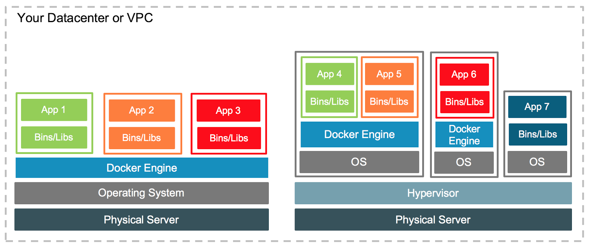

When a server cannot handle growing traffic, two strategies exist:

- **Vertical scaling** — increase the capacity of the existing server (more CPU, RAM, disk).
- **Horizontal scaling** — add more servers and distribute the load across them.

Horizontal scaling enables better fault tolerance and can handle unbounded traffic growth, but it introduces a critical problem: **consistency across environments**. An application that works on a developer's laptop may fail in production because of different OS versions, library versions, or environment variables.

{ width="35%" }

The answer is **containerisation** — packaging the application together with all its dependencies into a portable, self-contained unit that runs identically everywhere.

---

## Containers vs. Virtual Machines

Both containers and virtual machines (VMs) provide isolation, but at different levels of abstraction:

| Aspect | Docker Containers | Virtual Machines |
|:-|:-|:-|
| **Architecture** | Share the host OS kernel; isolate at the process level | Run a full OS (including kernel) on top of a hypervisor |
| **Resource efficiency** | Lightweight — no duplicate OS per instance | Higher overhead — each VM carries a complete OS |
| **Isolation** | Process-level isolation; sufficient for most applications | Stronger isolation; each VM has its own kernel |
| **Portability** | High — the image bundles the app and all dependencies | Lower — larger images, OS-specific configuration |
| **Startup time** | Seconds | Minutes (full OS boot) |
| **Typical use** | Microservices, CI/CD, horizontal scaling | Strong isolation requirements, different guest OS |

<figure markdown>
  { width="100%" }
  <figcaption><i>Source: <a href="https://dockerlabs.collabnix.com/beginners/difference-vm-containers.html" target="_blank">Docker Labs — Difference between VM and Containers</a></i></figcaption>
</figure>

The key insight: containers share the host kernel, so they are lighter and faster to start. VMs carry their own kernel, giving stronger isolation at higher cost.

---

## Topics covered

-   :fontawesome-brands-docker:{ .lg .middle } **Docker**

    ---

    Core concepts of Docker: images, containers, the Docker Engine, Dockerfiles, and the essential commands to build, run, inspect, and clean up containers.

    [:octicons-arrow-right-24: Docker](docker/index.md)

-   :material-file-code:{ .lg .middle } **Docker Compose**

    ---

    Declarative multi-container orchestration with `compose.yaml`. Covers service definitions, networking, volumes, environment variables, and best practices for development and delivery.

    [:octicons-arrow-right-24: Docker Compose](compose/index.md)

---

## Containerisation in the cloud

Cloud providers offer managed container services (AWS ECS/EKS, Google GKE, Azure AKS) that add automatic scaling, load balancing, and deep integration with other cloud services on top of the container model. Containers run inside virtual private networks (VPNs), adding a security boundary around the application.

=== ":fontawesome-brands-google: Google"

    :fontawesome-brands-youtube:{ .youtube } [Inside a Google data center](https://youtu.be/XZmGGAbHqa0){:target='_blank'}

    [{ width=100% }](https://youtu.be/XZmGGAbHqa0){:target='_blank'}

=== ":fontawesome-brands-aws: AWS"

    :fontawesome-brands-youtube:{ .youtube } [Inside Amazon's Massive Data Center](https://youtu.be/q6WlzHLxNKI){:target='_blank'}

    [{ width=100% }](https://youtu.be/q6WlzHLxNKI){:target='_blank'}

=== ":simple-tesla: Tesla"

    :fontawesome-brands-youtube:{ .youtube } [Inside Elon Musk's Colossus Supercomputer!](https://youtu.be/Tw696JVSxJQ){:target='_blank'}

    [{ width=100% }](https://youtu.be/Tw696JVSxJQ){:target='_blank'}

---

[^1]: [Docker vs. Virtual Machines: Differences You Should Know](https://cloudacademy.com/blog/docker-vs-virtual-machines-differences-you-should-know/){:target="_blank"}
[^2]: [Docker Networking](https://docs.docker.com/engine/network/){:target="_blank"}
