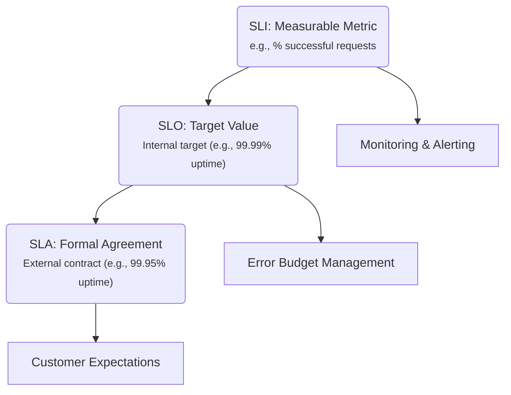

Reliability is a critical aspect of modern software systems, ensuring that services remain available, performant, and trustworthy for users. Central to managing reliability are three key concepts: **Service Level Indicators (SLIs)**, **Service Level Objectives (SLOs)**, and **Service Level Agreements (SLAs)**. This document provides a comprehensive overview of these concepts, their definitions, interrelationships, and practical applications.

---

## 1. Core Definitions

| Term | Full Name | Definition |
|------|-----------|------------|
| **SLI** | **Service Level Indicator** | A **measurable metric** that reflects the actual performance or quality of a service. |
| **SLO** | **Service Level Objective** | A **target value or range** for an SLI that the team commits to achieve. |
| **SLA** | **Service Level Agreement** | A **formal contract** between a service provider and a customer that defines the expected level of service, usually expressed via SLOs and consequences for missing them. |

---

## 2. In-Depth Breakdown

### SLI – The Raw Measurement

- **What it is**: A quantitative metric pulled from logs, monitoring systems, or instrumentation.
- **Examples**:
    - **Availability**: `% of successful HTTP requests` (e.g., 200 OK responses)
    - **Latency**: `95th percentile request latency < 200 ms`
    - **Error rate**: `Errors per second / Total requests per second`
    - **Throughput**: `Requests per second (RPS)`
    - **Durability**: `% of data writes acknowledged by 3+ replicas`
- **Key properties**:
    - **Objective** (not subjective)
    - **Directly measurable**
    - **Relevant to user experience**
- **How it's collected**:
    - Prometheus exporters, OpenTelemetry, Cloud monitoring, application logs, synthetic probes.

### SLO – The Target You Commit To

- **What it is**: A **specific, time-bound target** for an SLI.
- **Format**: `SLI ≥ threshold` over a rolling window (e.g., 28 days).
- **Examples**:
    - **Availability SLO**: `99.9%` of requests return 200 OK in a 28-day window.
    - **Latency SLO**: `95th percentile latency ≤ 150 ms` over 28 days.
    - **Error Budget**: Allowed error = `100% – 99.9% = 0.1%` → ~43 minutes downtime/month.
- **Error Budget** = `1 – SLO target`
    - Drives **reliability decisions**: If budget is consumed → stop features, focus on stability.

### SLA – The Contractual Commitment

- **What it is**: A **legal/business agreement** with **penalties** (credits, refunds) if SLOs are breached.
- **Structure**:
    - List of SLOs
    - Measurement period
    - Exclusions (maintenance, force majeure)
    - Remedies (service credits)
- **Example**:
    > "Provider guarantees 99.95% monthly uptime. If below, customer receives 10% credit for that month."
- **SLA ≠ SLO**: SLA is **external**, SLO is **internal target** (often stricter than SLA to provide buffer).

---

## 3. How SLI → SLO → SLA Connect (The Reliability Stack)



### Flow:

1. **Choose SLIs** → What matters to users?
2. **Set SLOs** → What can we realistically achieve?
3. **Define SLA** → What do we promise customers? (usually looser than SLO)

> **Best Practice**: `SLO > SLA` → gives **error budget buffer** to avoid penalties.

---

## 4. Roles & Responsibilities

| Role | Works with SLI? | Works with SLO? | Works with SLA? | Primary Tasks |
|------|------------------|------------------|------------------|-------------|
| **SRE (Site Reliability Engineer)** | ✅ **Yes** | ✅ **Yes** | ⚠️ Indirectly | - Define & monitor SLIs<br>- Propose & defend SLOs<br>- Manage error budgets<br>- Alerting & incident response |
| **Product Manager** | ⚠️ Reviews | ✅ **Yes** | ⚠️ Reviews | - Align SLOs with user needs<br>- Balance features vs reliability<br>- Approve risk during error budget spend |
| **Engineering / Dev Team** | ✅ **Yes** | ✅ **Yes** | No | - Instrument code for SLIs<br>- Fix issues consuming error budget<br>- Ship features within budget |
| **DevOps / Platform Team** | ✅ **Yes** | ⚠️ Indirectly | No | - Build monitoring pipelines<br>- Export SLIs to dashboards<br>- Automate SLO compliance checks |
| **Customer Success / Account Manager** | No | No | ✅ **Yes** | - Explain SLA to customers<br>- Handle credit requests<br>- Report SLA compliance |
| **Legal / Contracts Team** | No | No | ✅ **Yes** | - Draft & negotiate SLA terms<br>- Define exclusions, remedies |
| **Leadership (CTO, VP Eng)** | ⚠️ Reviews | ✅ **Yes** | ✅ **Yes** | - Approve SLO targets<br>- Sign off on SLA commitments<br>- Strategic reliability goals |

---

## 5. Real-World Example (Web Service)

| Component | Value |
|---------|-------|
| **SLI** | `% of HTTP requests returning 2xx/3xx in < 500ms` |
| **SLO** | `99.9%` over 28-day rolling window |
| **Error Budget** | `0.1%` → ~43 min/month allowed failure |
| **SLA** | `99.5%` monthly → if missed, 15% credit |

→ Team monitors SLI daily, uses error budget to decide:  
> "We have 10 min left this month → **no new deploys** until stabilized."

---

## 6. Key Best Practices

| Practice | Why |
|--------|-----|
| **SLIs must reflect user experience** | Avoid vanity metrics (e.g., CPU ≠ happiness) |
| **SLOs should be ambitious but achievable** | Too tight → constant alerts; too loose → no pressure |
| **Error budgets drive product decisions** | Google SRE: "If no budget left, reliability > features" |
| **SLA < SLO** | Buffer against penalties |
| **Automate SLI/SLO dashboards** | Real-time visibility |

---

## 7. Summary Table

| | SLI | SLO | SLA |
|---|-----|-----|-----|
| **Nature** | Metric | Target | Contract |
| **Audience** | Engineers | Team | Customer |
| **Example** | 99.95% success | 99.9% | 99.5% + credit |
| **Owner** | SRE / Dev | SRE + PM | Legal + CS |
| **Consequence** | Alert | Pause features | Refund |

---

## Final Takeaway

> **SLI** is **what you measure**  
> **SLO** is **what you promise internally**  
> **SLA** is **what you promise externally (with money on the line)**

They form a **hierarchy of reliability**:
```
SLI (data) → SLO (target) → SLA (contract)
```

Used together, they enable **data-driven reliability engineering** — the foundation of modern SRE practices[^1].


[^1]: [Google SRE Book, 2016](https://sre.google/books/){:target="_blank"}
