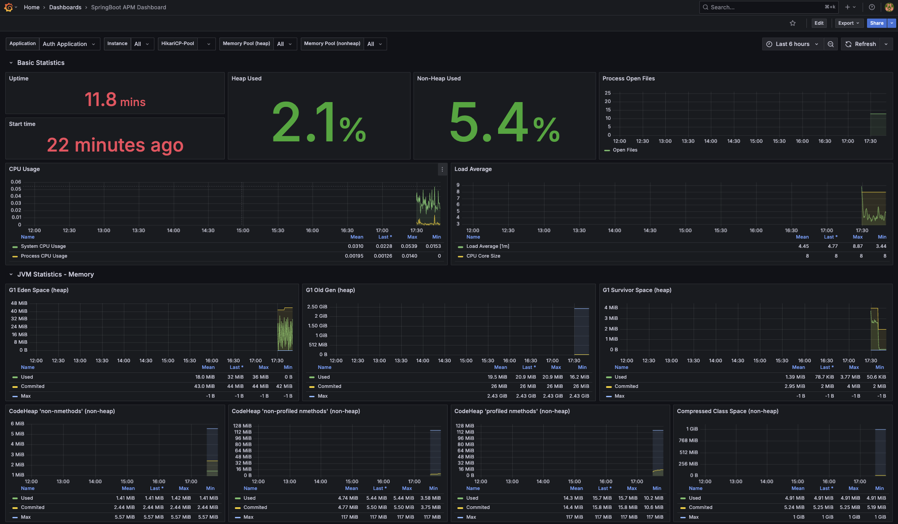

To deliver a high-performance application, you need to identify and address potential bottlenecks in your system. This document outlines some common bottlenecks and how to mitigate them.


## Caching

In-memory databases are a great way to improve the performance of your application. They can be used to store frequently accessed data, reducing the need to query the database for every request. Exemples of in-memory databases include Redis and Memcached.

<iframe width="100%" height="470" src="https://www.youtube.com/embed/YcI9b-lgi7w" allowfullscreen></iframe>


## Observability

Observability is the ability to measure and understand the internal state of a system based on its external outputs. It is essential for identifying and diagnosing performance issues in your application. Tools like Prometheus and Grafana can help you monitor your application's performance and identify bottlenecks.

- [Set Up Prometheus and Grafana for Spring Boot Monitoring](https://medium.com/simform-engineering/revolutionize-monitoring-empowering-spring-boot-applications-with-prometheus-and-grafana-e99c5c7248cf){target="_blank"}

- [Monitor a Spring Boot App Using Prometheus](https://www.baeldung.com/spring-boot-prometheus){target="_blank"}

- <iframe width="100%" height="470" src="https://www.youtube.com/embed/K_EI1SxVQ5Q" allowfullscreen></iframe>


!!! tip "Spring + Prometheus + Grafana"

    This tip provides a basic configuration for integrating Spring Boot with Prometheus and Grafana for monitoring purposes.

    Suggested file structure:

    ``` { .tree }
    microservices
        src
            main
                resources
                    application.yaml
        pom.xml
    volume
        prometheus
            prometheus.yml
        grafana
            provisioning
                datasources
                    datasources.yml
    .env # (1)!
    compose.yaml
    ```

    1. VOLUME=./volume

    === "1. pom.xml"

        Add the following dependencies to your `pom.xml` file:

        ``` { .xml .lineno="1" }
        --8<-- "./docs/exercises/bottlenecks/observability/pom.xml"
        ```

    === "2. application.yaml"

        Configure the `application.yaml` file to enable the actuator and Prometheus endpoint:

        ``` { .yaml .lineno="1" }
        --8<-- "./docs/exercises/bottlenecks/observability/application.yaml"
        ```

    === "3. compose.yaml"

        Include into the `compose.yaml` file to set up Prometheus and Grafana:

        ``` { .yaml .lineno="1" }
        --8<-- "./docs/exercises/bottlenecks/observability/compose.yaml"
        ```

    === "4. prometheus.yml"

        Connect Prometheus to your Spring Boot application by creating a `prometheus.yaml` file:

        ```{ .yaml .lineno="1" }
        --8<-- "./docs/exercises/bottlenecks/observability/prometheus.yml"
        ```

    === "5. Grafana to Prometheus"

        To connect Grafana to Prometheus, create a `datasources.yml` file in the `provisioning/datasources` directory:

        ```{ .yaml .lineno="1" }
        --8<-- "./docs/exercises/bottlenecks/observability/datasources.yml"
        ```

    === "6. Access Grafana"

        After starting the containers and binding the ports to your local machine, you can access Grafana at `http://localhost:3000` with the default username `admin` and password `admin`. You can then create or import dashboards to visualize the metrics collected from your Spring Boot application.

        For more information on how to create dashboards in Grafana, refer to the [Grafana documentation](https://grafana.com/docs/grafana/latest/getting-started/getting-started-grafana/){target="_blank"}.

        !!! tip "A nice dashboard for Spring Boot"

            You can find a nice dashboard for Spring Boot applications in the Grafana dashboard repository: [SpringBoot APM Dashboard](https://grafana.com/grafana/dashboards/12900){target="_blank"}.

            {width="100%"}


## Messaging

Message queues are a great way to decouple your application and improve its performance. They can be used to handle asynchronous tasks, such as sending emails or processing background jobs. Examples of message queues include RabbitMQ and Apache Kafka.

<iframe width="100%" height="470" src="https://www.youtube.com/embed/97TF2xZgAhU" allowfullscreen></iframe>


## Load Balancing

Load balancing is the process of distributing incoming network traffic across multiple servers. This helps to ensure that no single server is overwhelmed with requests, improving the overall performance and reliability of your application. Tools like Nginx and HAProxy can help you implement load balancing in your application.

- [How To Configure Nginx as a Reverse Proxy on Ubuntu](https://www.digitalocean.com/community/tutorials/how-to-configure-nginx-as-a-reverse-proxy-on-ubuntu-22-04){target="_blank"}
- <iframe width="100%" height="470" src="https://www.youtube.com/embed/5YOEIV-xPdc" allowfullscreen></iframe>


## Vulnerability Scanning

Vulnerability scanning is the process of identifying and addressing security vulnerabilities in your application. Tools like OWASP ZAP and Snyk can help you identify potential security issues in your code and dependencies.

<iframe width="100%" height="470" src="https://www.youtube.com/embed/361bfIvXMBI" allowfullscreen></iframe>


---

!!! danger "Entrega"

    Individualmente, cada aluno deve criar um repositório no GitHub, com a documentação em MkDocs dos exercícios realizados e também com o projeto e entrega o link via BlabkBoard. Na documentação publicada deve constar:

    - Nome do aluno e grupo;
    - Documentação das atividades realizadas;
    - Código fonte das atividades realizadas;
    - Documentação do projeto;
    - Código fonte do projeto;
    - Link para todos os repositórios utilizados;
    - Destaques para os bottlenecks implementados (ao menos 2 por indivíduo);
    - Apresentação do projeto;
    - Vídeo de apresentação do projeto (2-3 minutos);
    
    Um template de documentação pode ser encontrado em [Template de Documentação](https://hsandmann.github.io/documentation.template/){target="_blank"}.
