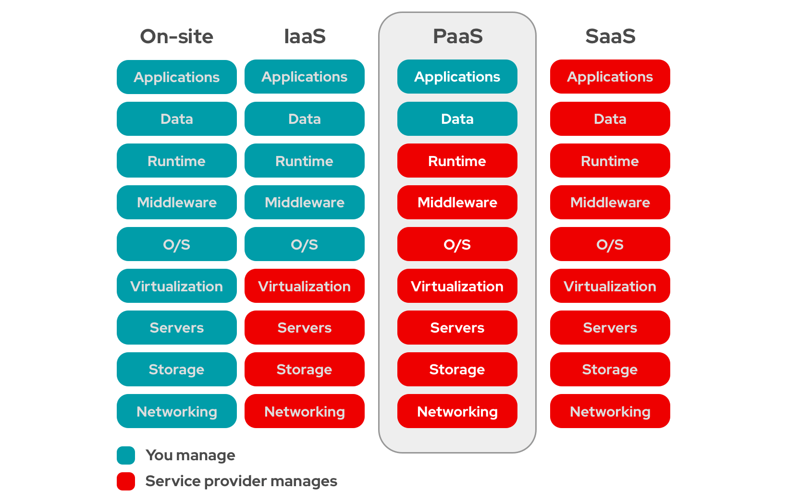

## Custos

A análise de custos é uma parte importante do desenvolvimento de software, pois ajuda a garantir que seu projeto esteja dentro do orçamento. Existem várias ferramentas disponíveis para ajudar na análise de custos, incluindo o AWS Cost Explorer[^1] e o AWS Budgets[^2].

!!! info "TO DO"

    Monte um plano de custos para o seu projeto, incluindo os custos de uso do EKS, RDS e outros serviços da AWS que você está utilizando. Use a calculadora de preços da AWS para estimar os custos do seu projeto.

## PaaS

A plataforma como serviço (PaaS) é um modelo de computação em nuvem que fornece uma plataforma para desenvolver, executar e gerenciar aplicativos sem a complexidade de construir e manter a infraestrutura normalmente associada ao desenvolvimento e lançamento de aplicativos.

{ width=100% }

!!! info "TO DO"

    Descreva onde seu grupo utilizou PaaS e como utilizou.

[^1]: [AWS Cost Explorer](https://aws.amazon.com/aws-cost-management/aws-cost-explorer/){target="_blank"}
[^2]: [AWS Budgets](https://aws.amazon.com/aws-cost-management/aws-budgets/){target="_blank"}
