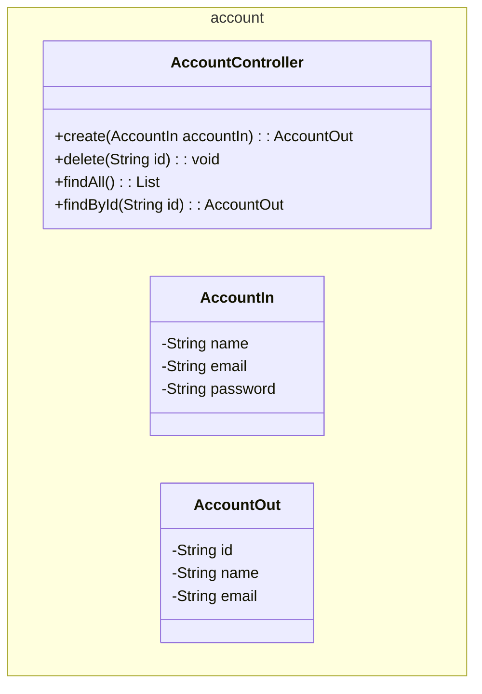

The interface of the Account microservice is defined in the `account` module, which contains the API definition and the data transfer objects (DTOs) for the Account microservice.

The main purpose of the section is to create the following API endpoints:



## 1. Repository

- a. At github, create a new repository for the Account interface. Example: `account`.

- b. Then, clone this repository as a submodule to your local machine. To do this, run the following commands at the root of the project:

    ``` bash
    git submodule add <repository_url> api/account
    git submodule update --init --recursive
    ```

This will create a new directory called `account` inside the `api` directory, which will contain the code for the Account interface. The resulting directory structure will look like this:

``` tree
platform/
    api/
        account/
```


## 2. Code

To code this interface module, we will use the Spring Boot framework, through the Spring Initializr, at [https://start.spring.io/], which is a web-based tool that allows us to generate a Spring Boot project with the necessary dependencies and configurations. 

<figure>
    
    <figcaption>Spring Initializr</figcaption>
</figure>

Note:

- Project: Maven
- Language: Java
- Spring Boot: 4.0.3 (stable version for now)
- Group: store (the company name, for example)
- Artifact: account (the microservice name, for example)
- Package name: store.account
- Packaging: Jar
- Configurarion: YAML
- Java: 25 (LTS version for now)

Additionally, we need to add the following dependencies:

- Lombok: a Java library that helps to reduce boilerplate code by generating getters, setters, constructors, and other common methods at compile time using annotations.

- OpenFeign: a declarative web service client that simplifies the process of making HTTP requests to other microservices. It allows us to define interfaces for our API clients and automatically generates the implementation at runtime.

Then, download the zip file and extract it to the `api/account` directory. The resulting directory structure will look like this:

``` tree
api/
    account/
        src/
            main/
                java/
                    store/
                        account/
                            AccountController.java
                            AccountIn.java
                            AccountOut.java
        pom.xml
```

!!! example "Source"

    === "pom.xml"

        ``` { .yaml .copy .select linenums="1" }
        --8<-- "https://raw.githubusercontent.com/repo-classes/pma252.account/refs/heads/main/pom.xml"
        ```

    === "AccountController"

        ``` { .java title='AccountController.java' .copy .select linenums='1' }
        --8<-- "https://raw.githubusercontent.com/repo-classes/pma252.account/refs/heads/main/src/main/java/store/account/AccountController.java"
        ```

    === "AccountIn"

        ``` { .java title='AccountIn.java' .copy .select linenums='1' }
        --8<-- "https://raw.githubusercontent.com/repo-classes/pma252.account/refs/heads/main/src/main/java/store/account/AccountIn.java"
        ```

    === "AccountOut"

        ``` { .java title='AccountOut.java' .copy .select linenums='1' }
        --8<-- "https://raw.githubusercontent.com/repo-classes/pma252.account/refs/heads/main/src/main/java/store/account/AccountOut.java"
        ```


## 3. Build and Install the Package

After coding the interface, we need to install the package to the local Maven repository, so that it can be used by other modules in the project. To do this, run the following command at the root of the project:

<!-- termynal -->

``` { bash }
> mvn clean install
```

---

Done! The Account interface is now ready to be used by other modules in the project.

Let's move on to the next section, where we will implement the Account microservice using the interface we just created.

[Service](../service/){ .md-button .md-button }

<!--
## API

!!swagger-http http://127.0.0.1:8080/account/api-docs!! -->


<!--  -->

