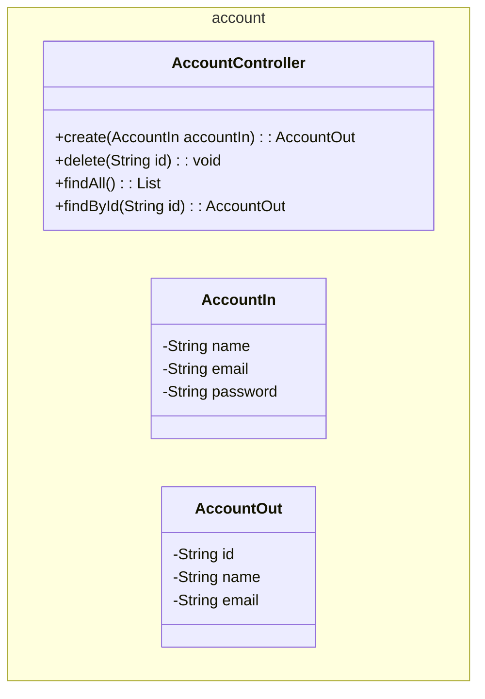
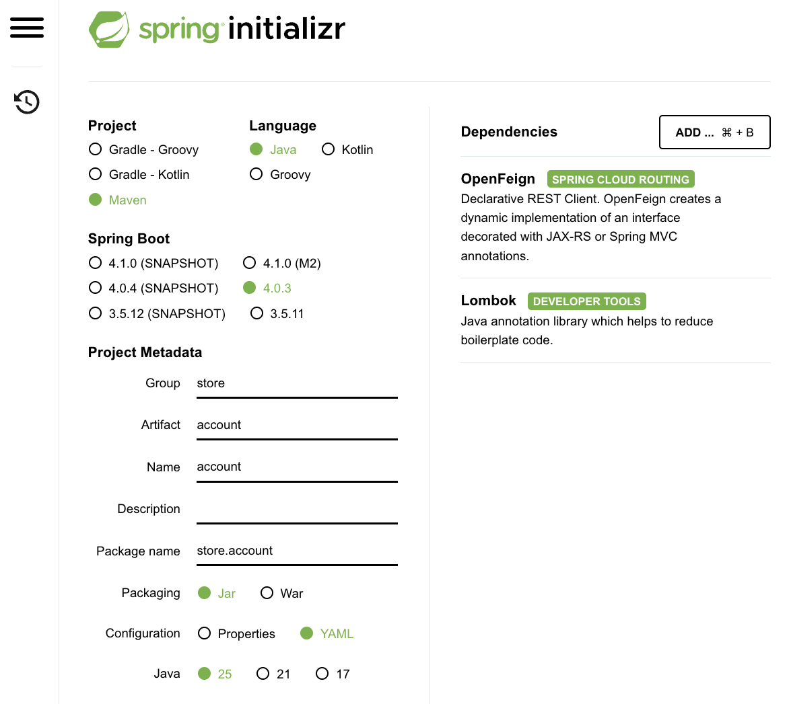

The interface of the Account microservice is defined in the `account` module, which contains the API definition and the data transfer objects (DTOs) for the Account microservice.

The main purpose of the section is to create the following API endpoints:



## 1. Repository

- a. At github, create a new repository for the Account interface. Example: `account`.

- b. Then, clone this repository as a submodule to your local machine. To do this, run the following commands at the root of the project:

    ``` bash
    git submodule add <repository_url> api/account
    git submodule update --init --recursive
    ```

This will create a new directory called `account` inside the `api` directory, which will contain the code for the Account interface. The resulting directory structure will look like this:

``` tree
platform/
    api/
        account/
```


## 2. Code

To code this interface module, we will use the Spring Boot framework, through the Spring Initializr, at [https://start.spring.io/], which is a web-based tool that allows us to generate a Spring Boot project with the necessary dependencies and configurations. 

{}


``` tree
api/
    account/
        src/
            main/
                java/
                    store/
                        account/
                            AccountController.java
                            AccountIn.java
                            AccountOut.java
        pom.xml
```

??? info "Source"

    === "pom.xml"

        ``` { .yaml .copy .select linenums="1" }
        --8<-- "https://raw.githubusercontent.com/repo-classes/pma252.account/refs/heads/main/pom.xml"
        ```

    === "AccountController"

        ``` { .java title='AccountController.java' .copy .select linenums='1' }
        --8<-- "https://raw.githubusercontent.com/repo-classes/pma252.account/refs/heads/main/src/main/java/store/account/AccountController.java"
        ```

    === "AccountIn"

        ``` { .java title='AccountIn.java' .copy .select linenums='1' }
        --8<-- "https://raw.githubusercontent.com/repo-classes/pma252.account/refs/heads/main/src/main/java/store/account/AccountIn.java"
        ```

    === "AccountOut"

        ``` { .java title='AccountOut.java' .copy .select linenums='1' }
        --8<-- "https://raw.githubusercontent.com/repo-classes/pma252.account/refs/heads/main/src/main/java/store/account/AccountOut.java"
        ```


    <!-- termynal -->

    ``` { bash }
    > mvn clean install
    ```


<!--
## API

!!swagger-http http://127.0.0.1:8080/account/api-docs!! -->


<!--  -->

