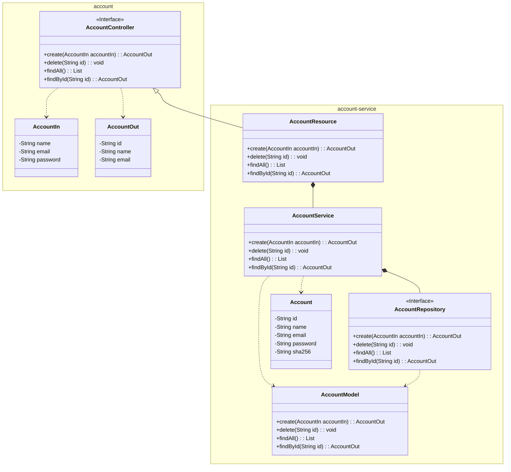
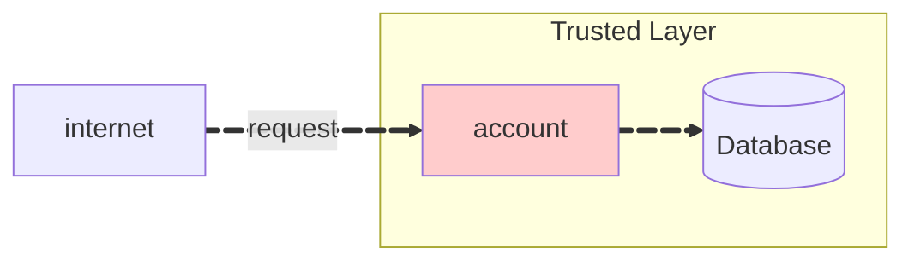

The implementation of the Account microservice is defined in the `account-service` module, which contains the implementation of the API defined in the `account` module, as well as, the database access and the business logic for the Account microservice. 



## 1. Repository

Create the repository for the Account interface on GitHub, and clone it as a submodule to your local machine;

``` bash
> git submodule add <repository_url> api/account-service
> git submodule update --init --recursive
```

``` tree
api/
    account/
    account-service/
```

## 2. Docker Compose

Previously work on the Account microservice, it is necessary to prepare the environment by installing the database to persist the data. For that, we will use a Docker Compose file to create a PostgreSQL container, as well as, a cluster to isolate the microservices from external access, creating a secure environment - trusted layer. A Docker Compose file is a YAML file that defines how Docker containers should behave in production. The file contains the configuration for the database, the microservices, and the network configuration.



``` tree
api/
    account/
    account-service/
    .env
    compose.yaml
```

=== "compose.yaml"
    ``` { .yaml .copy .select linenums="1" }
    --8<-- "https://raw.githubusercontent.com/repo-classes/pma.25.2/refs/heads/main/api/compose.yaml"
    ```

=== ".env"
    ``` { .sh .copy .select linenums="1" }
    --8<-- "https://raw.githubusercontent.com/repo-classes/pma.25.2/refs/heads/main/api/.env"
    ```

<!-- termynal -->

``` { bash }
> docker compose up -d --build

[+] Running 2/2
 ✔ Network store_default  Created            0.1s 
 ✔ Container store-db-1   Started            0.2s 
```


## 3. Account-Service Module

To create this interface module, we will use the Spring Boot framework, through the Spring Initializr, at [https://start.spring.io/], which is a web-based tool that allows us to generate a Spring Boot project with the necessary dependencies and configurations. 

{}


``` tree
api/
    account/
    account-service/
        src/
            main/
                java/
                    store/
                        account/
                            Account.java
                            AccountApplication.java
                            AccountModel.java
                            AccountParser.java
                            AccountRepository.java
                            AccountResource.java
                            AccountService.java
                resources/
                    application.yaml
                    db/
                        migration/
                            V2025.08.29.001__create_schema.sql
                            V2025.08.29.002__create_table_account.sql
                            V2025.09.02.001__create_index_email.sql
        pom.xml
        Dockerfile
    .env
    compose.yaml
```

??? info "Source"

    === "pom.xml"

        ``` { .yaml .copy .select linenums="1" }
        --8<-- "https://raw.githubusercontent.com/repo-classes/pma252.account-service/refs/heads/main/pom.xml"
        ```

    === "Dockerfile"

        ``` { .dockerfile .copy .select linenums="1" }
        --8<-- "https://raw.githubusercontent.com/repo-classes/pma252.account-service/refs/heads/main/Dockerfile"
        ```

    === "application.yaml"

        ``` { .yaml .copy .select linenums="1" }
        --8<-- "https://raw.githubusercontent.com/repo-classes/pma252.account-service/refs/heads/main/src/main/resources/application.yaml"
        ```

    === "Account.java"

        ``` { .java .copy .select linenums='1' }
        --8<-- "https://raw.githubusercontent.com/repo-classes/pma252.account-service/refs/heads/main/src/main/java/store/account/Account.java"
        ```

    === "AccountApplication.java"

        ``` { .java .copy .select linenums='1' }
        --8<-- "https://raw.githubusercontent.com/repo-classes/pma252.account-service/refs/heads/main/src/main/java/store/account/AccountApplication.java"
        ```

    === "AccountModel.java"

        ``` { .java .copy .select linenums='1' }
        --8<-- "https://raw.githubusercontent.com/repo-classes/pma252.account-service/refs/heads/main/src/main/java/store/account/AccountModel.java"
        ```

    === "AccountParser.java"

        ``` { .java .copy .select linenums='1' }
        --8<-- "https://raw.githubusercontent.com/repo-classes/pma252.account-service/refs/heads/main/src/main/java/store/account/AccountParser.java"
        ```

    === "AccountRepository.java"

        ``` { .java .copy .select linenums='1' }
        --8<-- "https://raw.githubusercontent.com/repo-classes/pma252.account-service/refs/heads/main/src/main/java/store/account/AccountRepository.java"
        ```

    === "AccountResource.java"

        ``` { .java .copy .select linenums='1' }
        --8<-- "https://raw.githubusercontent.com/repo-classes/pma252.account-service/refs/heads/main/src/main/java/store/account/AccountResource.java"
        ```

    === "AccountService.java"

        ``` { .java .copy .select linenums='1' }
        --8<-- "https://raw.githubusercontent.com/repo-classes/pma252.account-service/refs/heads/main/src/main/java/store/account/AccountService.java"
        ```

    === "V2025.08.29.001__create_schema.sql"

        ``` { .sql .copy .select linenums="1" }
        --8<-- "https://raw.githubusercontent.com/repo-classes/pma252.account-service/refs/heads/main/src/main/resources/db/migration/V2025.08.29.001__create_schema.sql"
        ```

    === "V2025.08.29.002__create_table_account.sql"

        ``` { .sql .copy .select linenums="1" }
        --8<-- "https://raw.githubusercontent.com/repo-classes/pma252.account-service/refs/heads/main/src/main/resources/db/migration/V2025.08.29.002__create_table_account.sql"
        ```

    === "V2025.09.02.001__create_index_email.sql"

        ``` { .sql .copy .select linenums="1" }
        --8<-- "https://raw.githubusercontent.com/repo-classes/pma252.account-service/refs/heads/main/src/main/resources/db/migration/V2025.09.02.001__create_index_email.sql"
        ```


<!-- termynal -->

``` { bash }
> mvn clean package spring-boot:run
```


[^1]: [Criando Migrations com Flyway no seu projeto Java Spring & PostgreSQL](https://www.youtube.com/watch?v=LX5jaieOIAk){target="_blank"}
