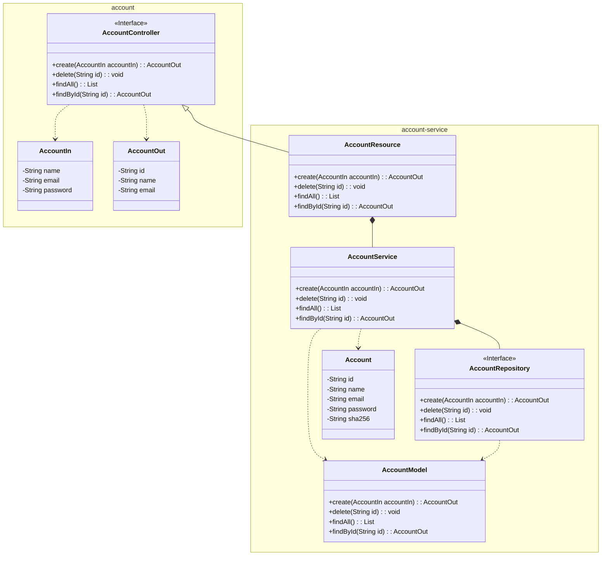

The implementation of the Account microservice is defined in the `account-service` module, which contains the implementation of the API defined in the `account` module, as well as, the database access and the business logic for the Account microservice. 



## 1. Repository

Create the repository for the Account interface on GitHub, and clone it as a submodule to your local machine;

``` bash
git submodule add <repository_url> api/account-service
```

``` tree
api/
    account/
    account-service/
```

## 2. Code

Now, we will code the implementation of the Account microservice, which consists of a lot of classes. The resulting directory structure will look like this:

``` tree
api/
    account-service/
        src/
            main/
                java/
                    store/
                        account/
                            AccountApplication.java
                            AccountResource.java
                resources/
                    application.yaml
        pom.xml
```

| Class | Description |
| --- | --- |
| `AccountResource` | This class is responsible for the API endpoints of the Account microservice, implementing the `AccountController` interface defined in the `account` module, and using the `AccountService` to handle the business logic of the API endpoints. |
| `AccountApplication` | This class is the main class of the Account microservice, which is responsible for running the Spring Boot application. It contains the `main` method, which is the entry point of the application. |

To code this microservice, we will use the Spring Boot framework, through the Spring Initializr, at [https://start.spring.io/], which is a web-based tool that allows us to generate a Spring Boot project with the necessary dependencies and configurations. 

<figure>
    
    <figcaption>Spring Initializr</figcaption>
</figure>

Note:

- Project: Maven
- Language: Java
- Spring Boot: 4.0.3 (stable version for now)
- Group: store (the company name, for example)
- Artifact: account-service (the implementation name)
- Package name: store.account
- Packaging: Jar
- Configurarion: YAML
- Java: 25 (LTS version for now)

Additionally, we need to add the following dependencies:

- *Spring Web*: a dependency that allows us to create RESTful web services using the Spring framework. It provides the necessary tools and libraries to handle HTTP requests and responses, as well as, to define API endpoints and controllers.

- *Lombok*: a Java library that helps to reduce boilerplate code by generating getters, setters, constructors, and other common methods at compile time using annotations.

- *OpenFeign*: a declarative web service client that simplifies the process of making HTTP requests to other microservices. It allows us to define interfaces for our API clients and automatically generates the implementation at runtime.

For now, we will just create the `AccountResource` and `AccountApplication` classes, and the `application.yaml` configuration file. We will implement the business logic and the data persistence in the next sections.

At `AccountResource.java`, the only endpoint implemented for now is `health-check`, which is a simple endpoint that returns a `200 OK` status code, indicating that the microservice is up and running.

!!! example "Source"

    === "pom.xml"

        ``` { .yaml .copy .select linenums="1" hl_lines="40-44"}
        --8<-- "docs/hands-on/1/service/code/pom.xml"
        ```

    === "application.yaml"

        ``` { .yaml .copy .select linenums="1" }
        --8<-- "docs/hands-on/1/service/code/application.yaml"
        ```

    === "AccountApplication.java"

        ``` { .java .copy .select linenums='1' }
        --8<-- "docs/hands-on/1/service/code/AccountApplication.java"
        ```

    === "AccountResource.java"

        ``` { .java .copy .select linenums='1' hl_lines="23-26"}
        --8<-- "docs/hands-on/1/service/code/AccountResource.java"
        ```


## 3. Package and Run

``` { bash }
mvn clean package
java -jar target/account-service-1.0.0.jar
```

or

``` { bash }
mvn clean package spring-boot:run
```

Check the health of the microservice by sending a GET request to the `health-check` endpoint:

``` { bash }
curl -X GET http://localhost:8080/health-check
```

If everything is working correctly, you should receive a `200 OK` status code in the response, indicating that the microservice is up and running.

---

Done! The Account Microservice is now ready to be used in the project.

Let's move on to the next section, where we will containerize the Account microservice using Docker, and run it using Docker Compose.

[Containerization](../containerization/){ .md-button .md-button }
