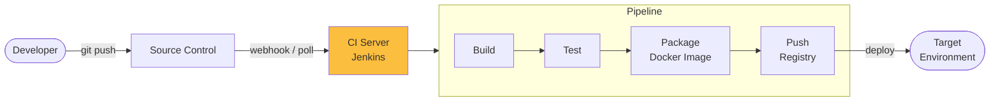
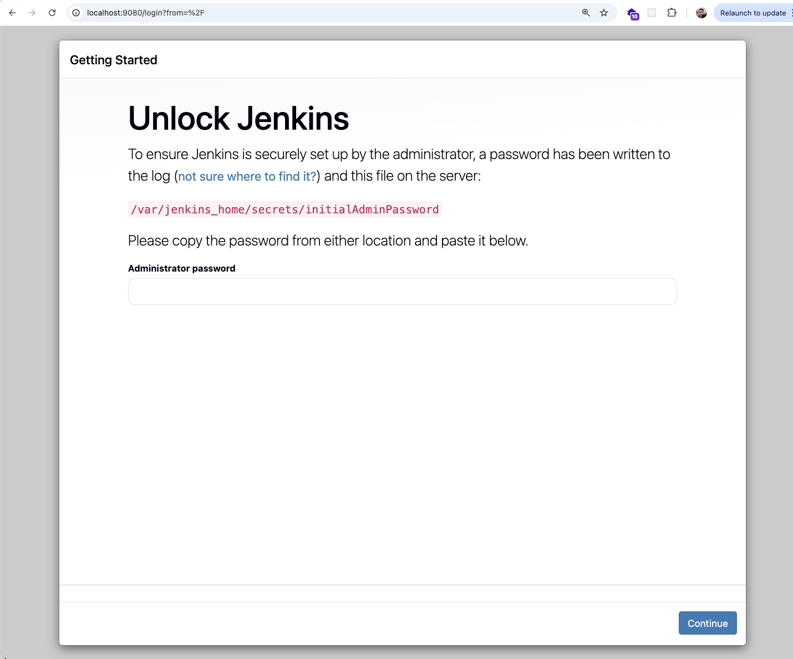
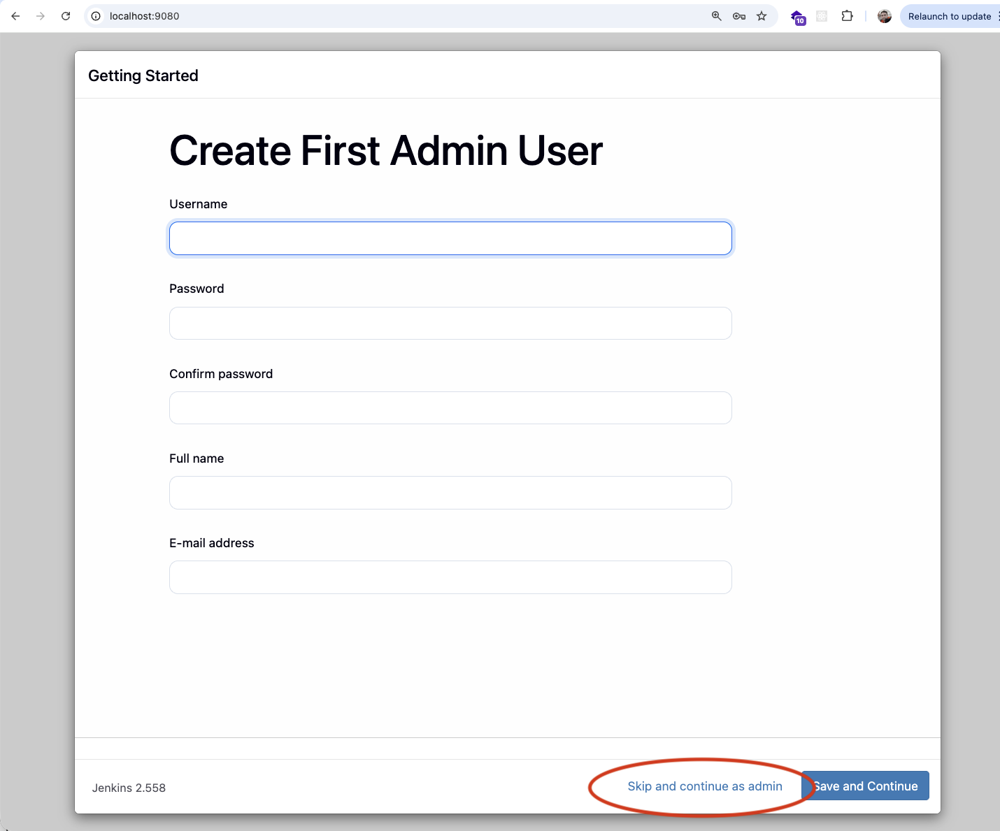
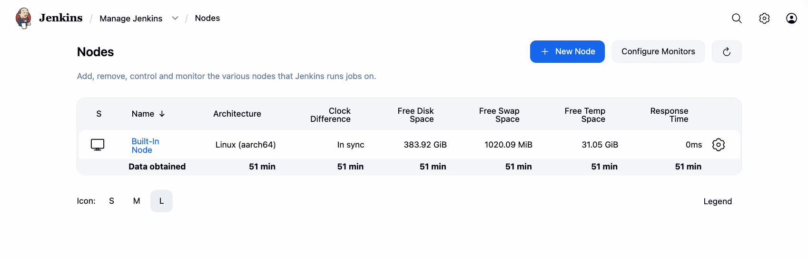
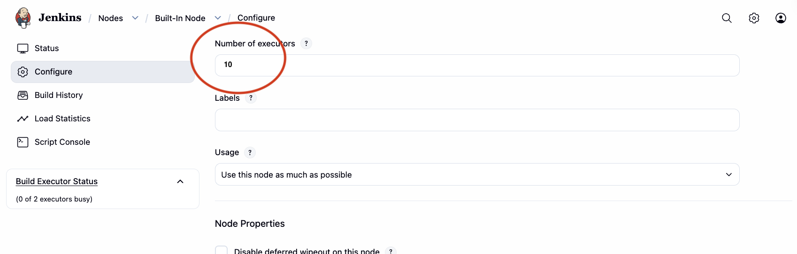
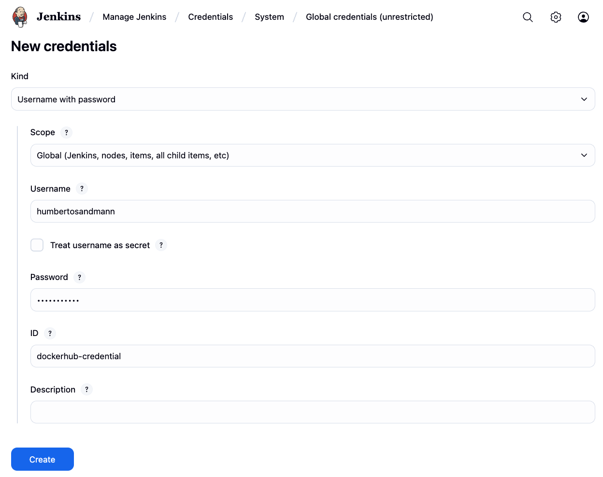
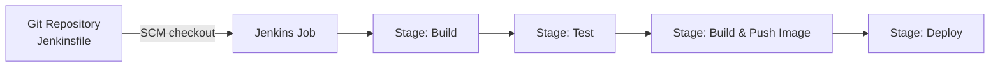
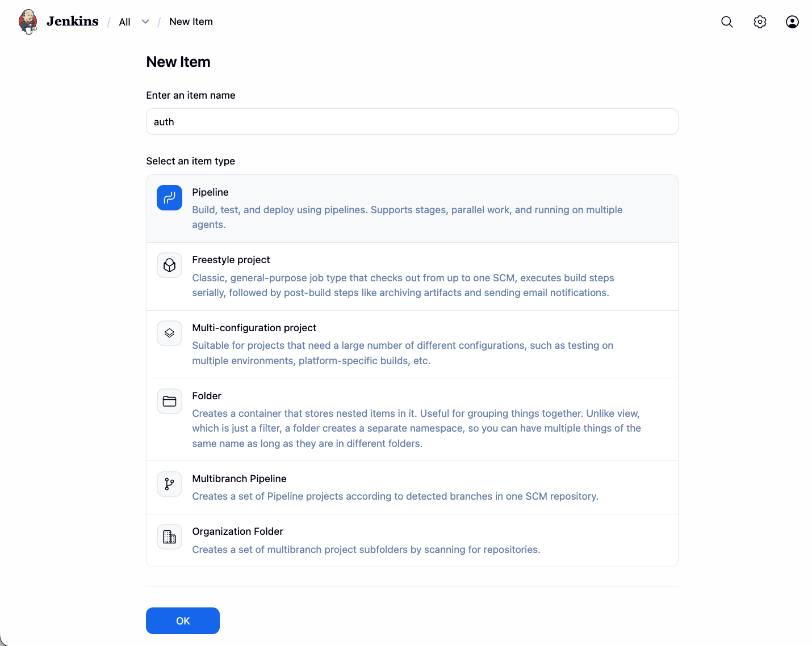
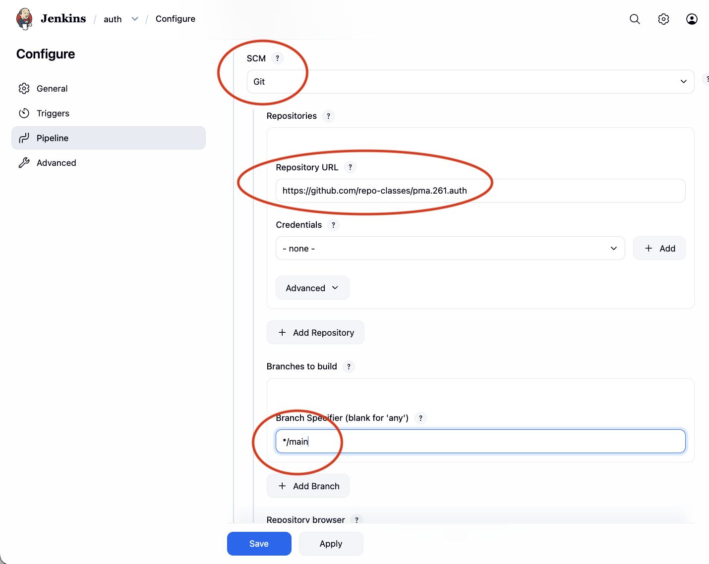
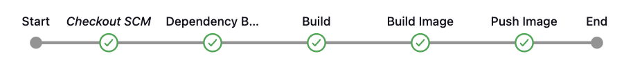

[DevOps](https://en.wikipedia.org/wiki/DevOps){:target="_blank"} practices aim to shorten the software development lifecycle by automating the build, test, and deployment stages. Two key practices underpin this automation[^1]:

- **Continuous Integration (CI)** — developers merge changes frequently; each merge triggers an automated build and test cycle.
- **Continuous Delivery (CD)** — every change that passes CI is automatically packaged and made ready to deploy to any environment.



[Jenkins](https://www.jenkins.io/){:target="_blank"} is one of the most widely adopted open-source automation servers. It orchestrates CI/CD pipelines through a rich plugin ecosystem and supports **Pipeline as Code** — pipeline definitions committed to the repository alongside application code in a file called `Jenkinsfile`[^2].

## 1. Setup — Containerized Jenkins

Running Jenkins inside Docker keeps the host machine clean and makes the environment reproducible across machines.

!!! info "Source"

    ``` { .tree .copy .select }
    api/
    jenkins/
        compose.yaml
    ```

    ``` { .yaml .copy .select linenums="1" title="compose.yaml" }
    --8<-- "docs/hands-on/4/jenkins/code/compose.yaml"
    ```

The `compose.yaml` builds a custom image on top of `jenkins/jenkins:jdk25` with extra tooling pre-installed:

| Tool | Purpose |
|---|---|
| Maven | Build Java projects |
| Docker CE | Build and push container images from within pipelines |
| kubectl | Deploy to Kubernetes clusters |
| AWS CLI | Interact with AWS services (ECR, ECS, EKS …) |

The Jenkins process is added to the `docker` group so that pipelines can invoke `docker` commands without requiring root. The host Docker socket (`/var/run/docker.sock`) is bind-mounted into the container for this purpose[^3].

!!! warning "Docker socket security"
    Mounting `/var/run/docker.sock` gives the container full control over the host Docker daemon. This is acceptable for local development, but should be hardened (e.g., rootless Docker or a dedicated build daemon) in shared or production environments.

**Start the server:**

``` { .bash .select }
jenkins/# docker compose up -d --build

[+] Running 2/2
 ✔ jenkins Created              0.1s
 ✔ Container jenkins Started    0.2s
```

Jenkins is now available at [http://localhost:9080/](http://localhost:9080/){target="_blank"}.

## 2. Initial Configuration

### Unlock Jenkins

On first start, Jenkins generates a random *initial admin password* to prevent unauthorised access[^4]. Open the UI and enter it when prompted:

{width=100%}

Retrieve the password with either command:

=== "From container logs"

    ``` { .bash .select }
    docker logs jenkins 2>&1 | grep -A 3 "initialAdminPassword"
    ```

=== "From the secrets file"

    ``` { .bash .select }
    docker exec jenkins cat /var/jenkins_home/secrets/initialAdminPassword
    ```

!!! warning "Windows — run as Administrator"
    Open the terminal as **Administrator** to avoid permission errors when reading the Jenkins secrets directory.

    {width=100%}

After entering the password, choose **Install suggested plugins** and create an admin user.

### Number of Executors

An *executor* is a slot where Jenkins runs one pipeline stage or job. The default is 2; raising it lets multiple jobs run in parallel, which is useful when building several microservices in the same instance.

**Manage Jenkins → Nodes → Built-In Node → Configure → Number of executors → 10**

=== "Nodes"

    

=== "Configure"

    

## 3. Credentials

Before creating pipelines that push Docker images, store the Docker Hub secret in Jenkins' credential store. Credentials are injected into pipelines at runtime — they are never written to disk or visible in logs[^5].

**Manage Jenkins → Credentials → System → Global credentials → Add Credentials**

{width=100%}

| Field | Value |
|---|---|
| Kind | Username with password |
| Username | Your Docker Hub username |
| Password | Docker Hub access token (see tip below) |
| ID | `dockerhub-credential` |

!!! tip "Use access tokens, not your account password"
    Create a dedicated token with **Read & Write** scope at **Docker Hub → Account Settings → Security → Access Tokens**. If the token is ever compromised you can revoke it without touching your account password[^6].

## 4. Pipeline as Code

A `Jenkinsfile` describes the pipeline in a declarative DSL and lives in the root of the repository. Jenkins checks it out automatically when a build is triggered, so the pipeline evolves alongside the code[^7].



Jenkins supports two pipeline syntaxes:

| Syntax | Description |
|---|---|
| **Declarative** | Structured, opinionated DSL — recommended for most projects |
| **Scripted** | Full Groovy — maximum flexibility, steeper learning curve |

The examples below use the **declarative** syntax.


## 5. Examples

### `auth` — Build only

The first pipeline compiles the `auth` module and produces the artifact:


!!! info "Source"

    ``` { .tree .copy .select }
    api/
        auth/
            Jenkinsfile
    ```

    ``` { .groovy .copy .select linenums="1" title="Jenkinsfile" }
    --8<-- "docs/hands-on/4/jenkins/code/Jenkinsfile.auth"
    ```

The single `Build` stage runs `mvn -B -DskipTests clean install`. The `-B` flag enables *batch mode* (no interactive prompts), which is required in non-interactive CI environments.

**Creating a Job**

=== "New item"

    

=== "Configure pipeline"

    

Create a **New Item**, choose the **Pipeline** type, and set the *Definition* to **Pipeline script from SCM**. Jenkins will clone the repository and read the `Jenkinsfile` on every build.

### `auth-service` — Build, package, and push

{width=100%}

A complete pipeline that builds the service, creates a multi-platform Docker image, and pushes it to Docker Hub:

!!! info "Source"

    ``` { .tree .copy .select }
    api/
        auth-service/
            Jenkinsfile
    ```

    ``` { .groovy .copy .select linenums="1" title="Jenkinsfile" }
    --8<-- "docs/hands-on/4/jenkins/code/Jenkinsfile.auth-service"
    ```

#### Walkthrough

**`environment` block**

```groovy
environment {
    SERVICE = 'auth'
    NAME    = "humbertosandmann/${env.SERVICE}"
}
```

Declares two pipeline-wide variables. `NAME` is the fully-qualified Docker Hub repository. Referencing `env.SERVICE` inside `NAME` avoids duplicating the service name.

---

**`Dependencies` stage**

```groovy
stage('Dependencies') {
    steps {
        build job: 'account', wait: true
        build job: 'auth',    wait: true
    }
}
```

Triggers upstream Jenkins jobs before proceeding. `wait: true` blocks until each job completes successfully, guaranteeing that dependency artifacts are up to date before the current service is built.

---

**`Build` stage**

```groovy
sh 'mvn -B -DskipTests clean package'
```

Compiles the project and produces the runnable JAR. Tests are intentionally skipped here — add a separate `Test` stage with `mvn test` if you want the pipeline to enforce test results.

---

**`Build & Push Image` stage**

```groovy
withCredentials([usernamePassword(
    credentialsId: 'dockerhub-credential',
    usernameVariable: 'USERNAME',
    passwordVariable: 'TOKEN')]) {

    sh "docker login -u $USERNAME -p $TOKEN"
    sh "docker buildx create --use \
          --platform=linux/arm64,linux/amd64 \
          --node multi-platform-builder-${env.SERVICE} \
          --name multi-platform-builder-${env.SERVICE}"
    sh "docker buildx build \
          --platform=linux/arm64,linux/amd64 \
          --push \
          --tag ${env.NAME}:latest \
          --tag ${env.NAME}:${env.BUILD_ID} \
          -f Dockerfile ."
    sh "docker buildx rm --force multi-platform-builder-${env.SERVICE}"
}
```

- **`withCredentials`** — injects the Docker Hub token stored in step 3 into the build environment. The values are masked in all Jenkins logs[^5].
- **`docker buildx`** — creates a *BuildKit* builder that cross-compiles images for both `linux/arm64` (Apple Silicon, AWS Graviton) and `linux/amd64` (standard x86-64)[^8].
- **Dual tags** — `:latest` provides a stable reference; `:<BUILD_ID>` pins a specific Jenkins build so any image can be traced back to its source commit.
- The builder instance is removed after the push to free up system resources.

---

[^1]: HUMBLE, J.; FARLEY, D. *Continuous Delivery: Reliable Software Releases through Build, Test, and Deployment Automation*. Addison-Wesley, 2010.

[^2]: [Jenkins — Pipeline overview](https://www.jenkins.io/doc/book/pipeline/){:target="_blank"}. Jenkins documentation.

[^3]: MERKEL, D. Docker: Lightweight Linux containers for consistent development and deployment. *Linux Journal*, 2014. See also [Docker socket documentation](https://docs.docker.com/engine/reference/commandline/dockerd/#daemon-socket-option){:target="_blank"}.

[^4]: [Jenkins — Initial setup](https://www.jenkins.io/doc/book/installing/docker/#setup-wizard){:target="_blank"}. Jenkins documentation.

[^5]: [Jenkins — Using credentials](https://www.jenkins.io/doc/book/using/using-credentials/){:target="_blank"}. Jenkins documentation.

[^6]: [Docker Hub — Access tokens](https://docs.docker.com/docker-hub/access-tokens/){:target="_blank"}. Docker documentation.

[^7]: [Jenkins — Pipeline as Code](https://www.jenkins.io/doc/book/pipeline/pipeline-as-code/){:target="_blank"}. Jenkins documentation.

[^8]: [Docker Buildx — Multi-platform images](https://docs.docker.com/build/building/multi-platform/){:target="_blank"}. Docker documentation.
