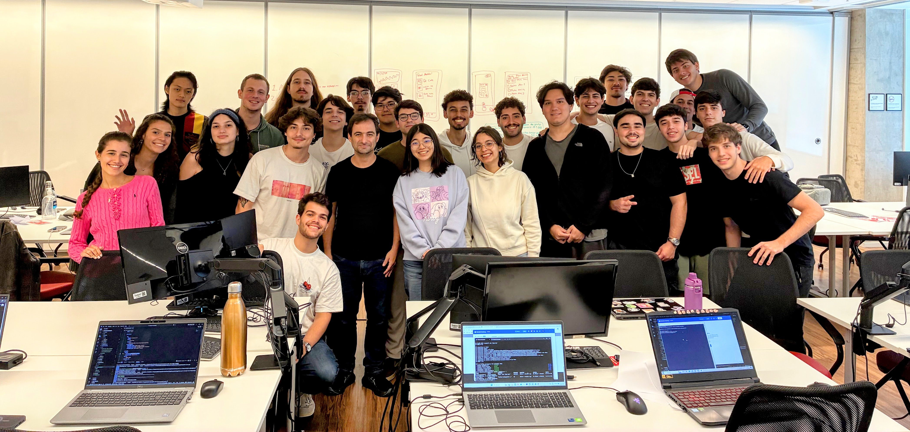

{ .rounded-corners }

## Meetings

| :octicons-location-24: | :fontawesome-regular-calendar: | :fontawesome-regular-clock: |
|-|:-:|:-:|
| Aula | Qua. | 12h00 :fontawesome-solid-arrow-right-long: 14h00 |
| Aula | Sex. | 12h00 :fontawesome-solid-arrow-right-long: 14h00 |
| Atendimento | Ter. | 12h00 :fontawesome-solid-arrow-right-long: 13h30 |


## Instructors

| [:material-web:](https://hsandmann.github.io/){:target="_blank"} [:simple-github:](https://github.com/hsandmann){:target="_blank"} [:material-linkedin:](https://www.linkedin.com/in/hsandmann/){:target="_blank"} Instructor | Humberto Sandmann |

| [:simple-github:](https://github.com/luabatepietro){:target="_blank"} [:material-linkedin:](https://www.linkedin.com/in/lucas-abatepietro-286a03270/){:target="_blank"} Student Assistant | Lucas Abatepietro |


## Students

<iframe src="https://docs.google.com/spreadsheets/d/e/2PACX-1vS3EF2nfXJsWgxtRItuWLGoA653AQOJACsYEIbut9if2qXwGpNi9HD8gRAiaWs7OT1ms0nWLzX50e7W/pubhtml?gid=1397413588&&amp;single=false&amp;widget=false&amp;headers=false" width="100%" height="750px"></iframe>


## Grade

$$
\text{Final Grade} = \left\{\begin{array}{lll}
    \text{Individual} \geq 5 \bigwedge \text{Team} \geq 5 &
    \implies &
    \displaystyle \frac{ \text{Individual} + \text{Team} } {2}
    \\
    \\
    \text{Otherwise} &
    \implies &
    \min\left(\text{Individual}, \text{Team}\right)
    \end{array}\right.
$$

```python exec="1" html="1"
--8<-- "docs/versions/2026.1/grade.py"
```

1. **Quizzes**: the course will have 3 quizzes, the quiz with the lowest grade will be dropped. And, the final quiz grade will be the uniform average of the two best grade quizzes.

1. **Team**: the team have to be composed **by 2 up to 3 members**. The team grade will be the same for all members of the team. The team grade will be based on the project delivery and documentation.

    !!! warning "Group Registration"

        :fontawesome-regular-calendar: Deadline to register: ==**March 6th, 2026**==.

        :material-account-group: Teams from 2 up to 3 members.

        :material-github: Create a repository on GitHub to share the project code and documentation.

        :material-form-select: Form to register student groups: [https://forms.gle/DoRxGcnx5vb5ggkYA](https://forms.gle/DoRxGcnx5vb5ggkYA){target="_blank"}.

        :material-cloud: This is ==MANDATORY== to organize the teams and the AWS accounts.

    !!! tip "Repository name"

        The repository name should be something profissional, for example: `platform`, `microservices`, etc.

        Also, the repository should linked to GitHub authors.


1. **Documentation**: the project documentation will be evaluated based on the quality of the documentation and the completeness of the documentation. The documentation should be complete and should cover all the aspects of the project, including the architecture, the design decisions, the implementation details, and the testing strategy. The documentation should be clear and concise, and should be easy to understand. The documentation should be well-structured and should follow the best practices of software documentation. The purpose of the documentation is to provide a portfolio about the subject to potential employers or collaborators.

    !!! warning "Documentation Requirements"

        :fontawesome-regular-calendar: Deadline to deliver: ==**May 22th, 2026**==.

        :material-github: The project documentation HAVE TO be hosted on GitHub Pages and should be public;

        :simple-materialformkdocs: The format to publish the documentation is [mkdocs](https://www.mkdocs.org/){target="_blank"}, the documentation should be published in the GitHub Pages;

        :octicons-project-template-16: A template based on [material](https://squidfunk.github.io/mkdocs-material/){target="_blank"} is available to assist with the documentation: [delivery template](https://hsandmann.github.io/documentation.template/){target="_blank"}.

    !!! tip "Template"

        A template based on [material](https://squidfunk.github.io/mkdocs-material/){target="_blank"} is available to assist with the documentation: [delivery template](https://hsandmann.github.io/documentation.template/){target="_blank"}.

        1. Fork the template repository;
        1. Clone the forked repository;
        1. Edit the documentation;
        1. Push the changes to the forked repository;
        1. Publish the documentation on GitHub Pages.

        There is instructions more accurate on [Using this template](https://hsandmann.github.io/documentation.template/thisdocumentation/){target="_blank"}.


## Planning

<iframe src="https://docs.google.com/spreadsheets/d/e/2PACX-1vSyTlMWIk3iQTAM0Vy_X_GXwRu4miSBmRCHWxwTR-8cf0zAlWvcY1HsxCZxV6MRmflvbWh2gCKJ647F/pubhtml?widget=true&amp;headers=false" width="100%" height="600px"></iframe>


## Repositories

Principal: 
[https://github.com/repo-classes/pma.26.1](https://github.com/repo-classes/pma.26.1){target="_blank"}

<!-- | Microservice | Interface | Implementation |
|-|-|-|
| Account | [account](https://github.com/repo-classes/pma252.account){target="_blank"} | [account-service](https://github.com/repo-classes/pma252.account-service){target="_blank"} |
| Auth | [auth](https://github.com/repo-classes/pma252.auth){target="_blank"} | [auth-service](https://github.com/repo-classes/pma252.auth-service){target="_blank"} |
| Gateway |  | [gateway-service](https://github.com/repo-classes/pma252.gateway-service){target="_blank"} |
 -->

